<picture>
  <source media="(prefers-color-scheme: dark)" srcset="docs/images/brand/banner-dark.svg">
  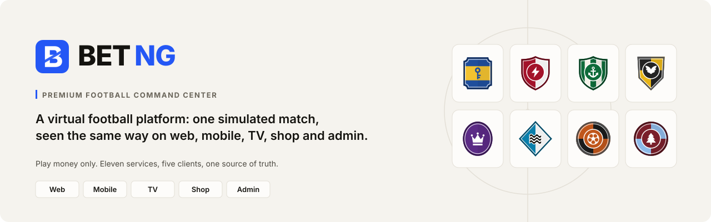
</picture>

<p align="center">
  
  
  
  
  
  
  
  
</p>

<p align="center">
  <a href="#what-it-is">What it is</a> ·
  <a href="#screens">Screens</a> ·
  <a href="#architecture">Architecture</a> ·
  <a href="#technology">Technology</a> ·
  <a href="#getting-started">Getting started</a> ·
  <a href="#quality-and-proof">Quality and proof</a> ·
  <a href="#documentation">Documentation</a> ·
  <a href="SECURITY.md">Security</a>
</p>

---

## What it is

BETNG is a virtual football platform built as a portfolio system. Four simulated leagues play round after round on a real clock. Every match is simulated **once**, by the platform, and every person sees that same match: the same fixture, prices, timeline, result and settlement, whether they are on the web, on a phone, watching a shop television, standing at a cashier terminal or working in the admin console.

It is a simulation that uses **play money only**. Nothing here is, or may be, connected to real-money wagering or a payment provider.

| | |
| --- | --- |
| **One match, one result** | The simulation runs once at kick-off. The result is committed, immutable, and revealed minute by minute. Bets can never influence it, and no one, admins included, can choose it. |
| **The platform decides** | Clock, phase, odds, market status, bet acceptance, payouts, balances, risk decisions and operator figures all come from the backend. The clients display them and never compute them. |
| **Five clients, one model** | Web, mobile, TV, shop and admin all render the same canonical match, identified by one `match_id`. |
| **Money is exact** | Integer kobo from the database to the pixel. No floating-point arithmetic touches an amount, and settlement pays on the odds stored at acceptance. |
| **Built to be checked** | 2,577 automated tests across both halves, a 22-step end-to-end scenario against the real services, and a verification script that fails if a production bundle contains development code. |

## Screens

All screenshots below were taken from the apps **running against the real platform** (`pnpm dev` services, live matches), not the development stand-in.

### Web

<table>
  <tr>
    <td width="50%">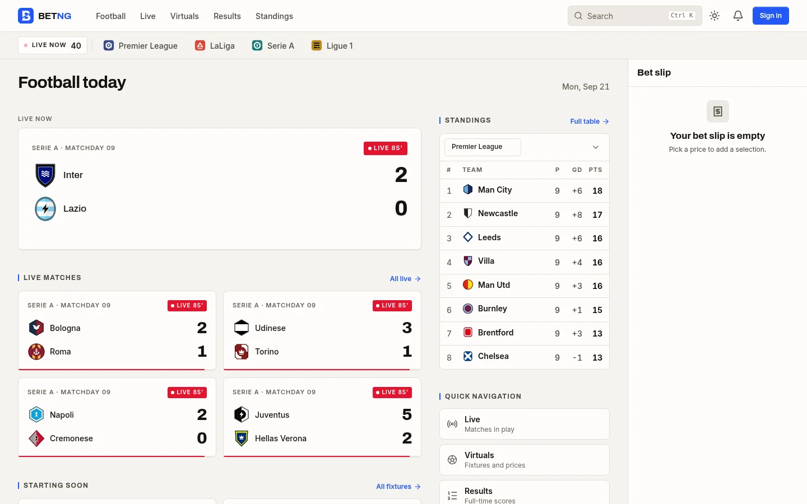<br><sub><b>Home.</b> The football command center: the most important live match, live and upcoming matches, standings.</sub></td>
    <td width="50%">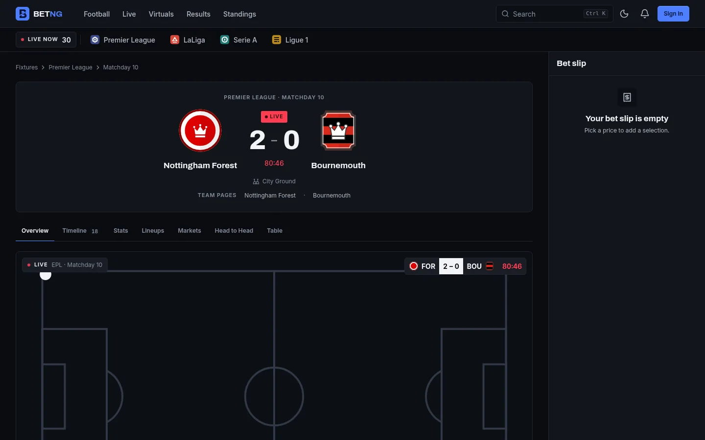<br><sub><b>Match center, dark.</b> Score and minute from the platform's clock; seven tabs.</sub></td>
  </tr>
  <tr>
    <td><br><sub><b>Lineups.</b> Formations, captains and substitution minutes, as the platform reports them.</sub></td>
    <td>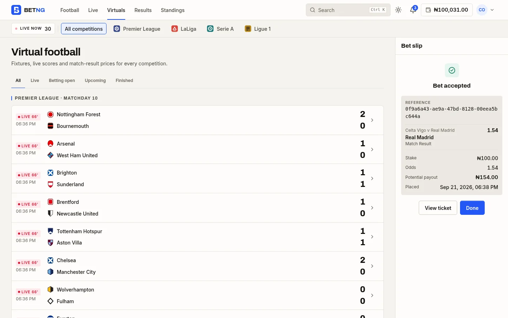<br><sub><b>Bet accepted.</b> Reference and potential payout are the platform's; the slip showed an estimate until then.</sub></td>
  </tr>
  <tr>
    <td><br><sub><b>Search.</b> Ctrl/Cmd+K, answered by the platform's search route.</sub></td>
    <td>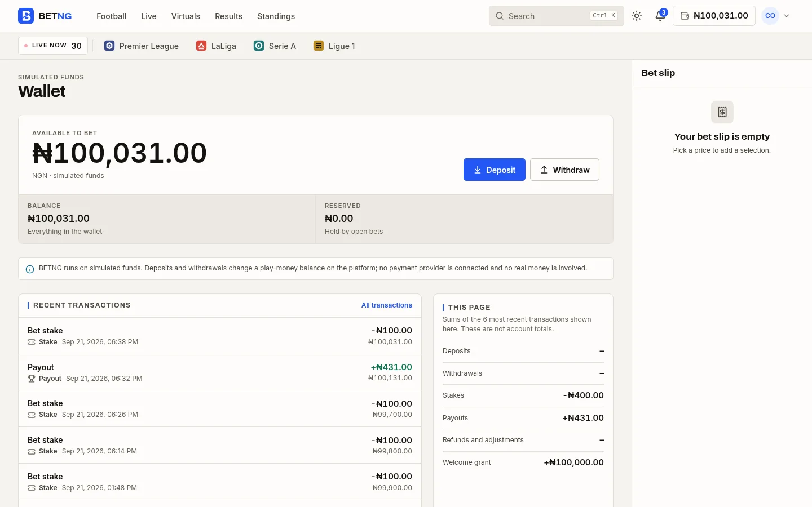<br><sub><b>Wallet.</b> Balances in integer kobo, deposits and withdrawals, recent ledger rows.</sub></td>
  </tr>
</table>

### Web on a phone

The same web app at 390 px: bottom navigation, sheets and a sticky slip bar. (The native Expo app shares the view models, crests and icons; it has been typechecked and linted but not yet captured on a device.)

<table>
  <tr>
    <td width="25%">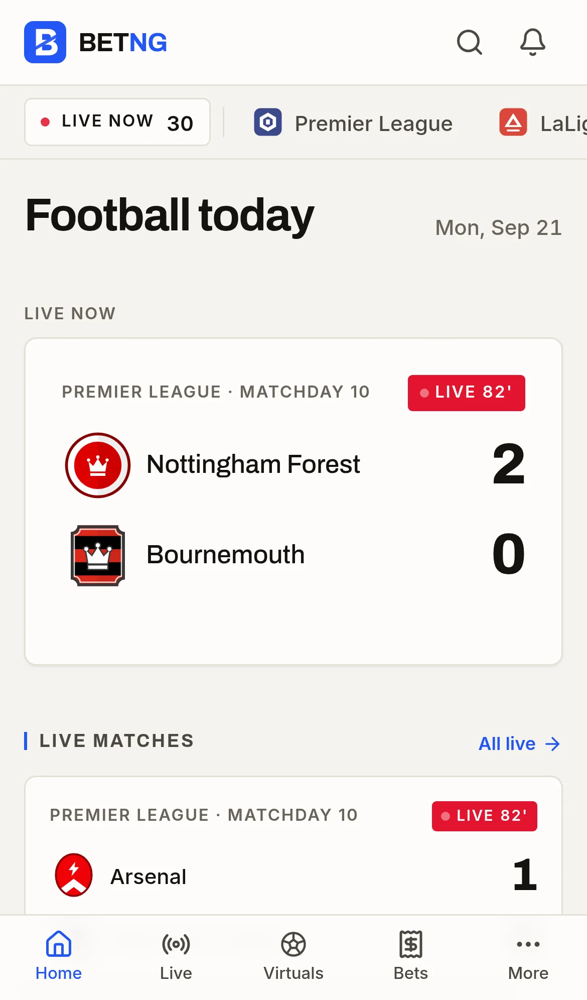<br><sub>Home</sub></td>
    <td width="25%">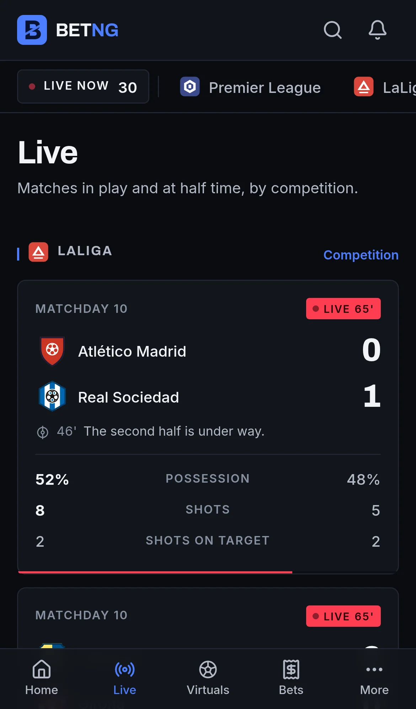<br><sub>Live, dark</sub></td>
    <td width="25%">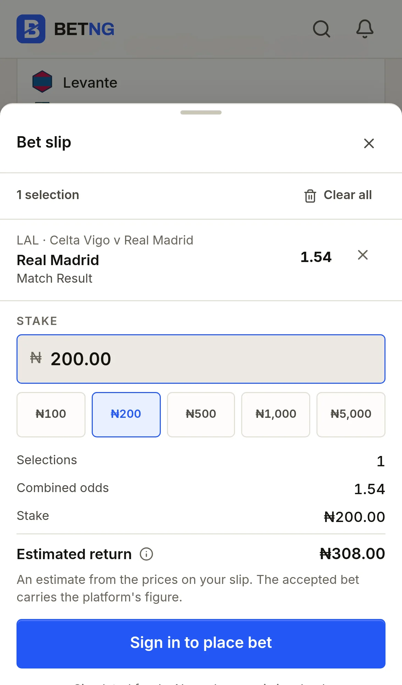<br><sub>Slip as a bottom sheet</sub></td>
    <td width="25%"><br><sub>More</sub></td>
  </tr>
</table>

### TV, shop and admin

<table>
  <tr>
    <td width="50%">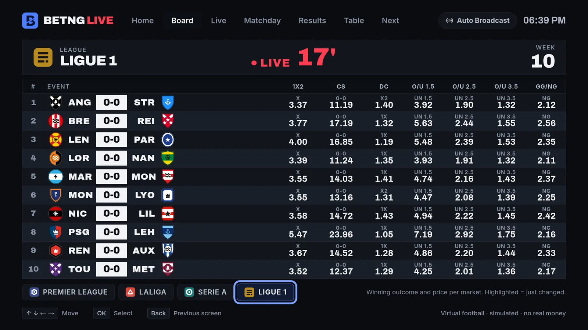<br><sub><b>TV board.</b> One league's week under a shared clock, readable from across a room, driven by a remote.</sub></td>
    <td width="50%">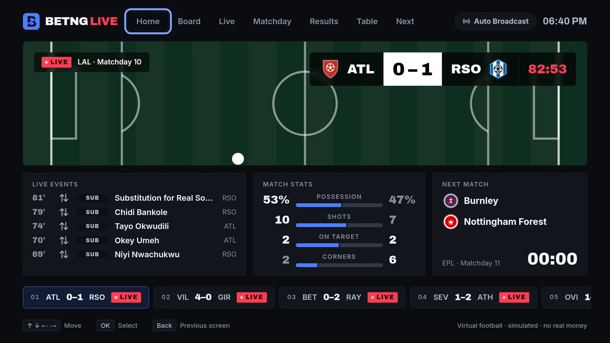<br><sub><b>TV match.</b> Pitch, score bug, live events and statistics. No betting controls anywhere on TV.</sub></td>
  </tr>
  <tr>
    <td>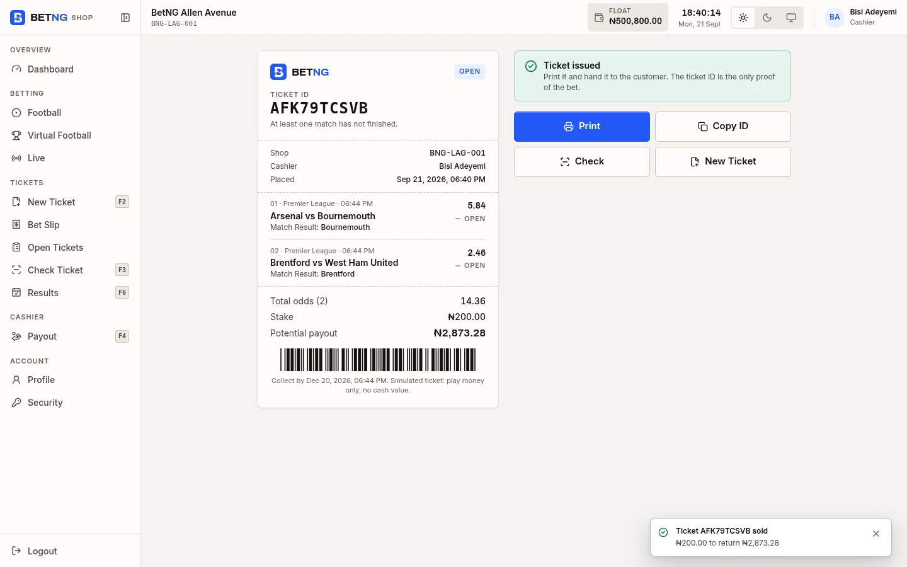<br><sub><b>Shop ticket.</b> The reference and barcode come from the platform-issued ticket.</sub></td>
    <td>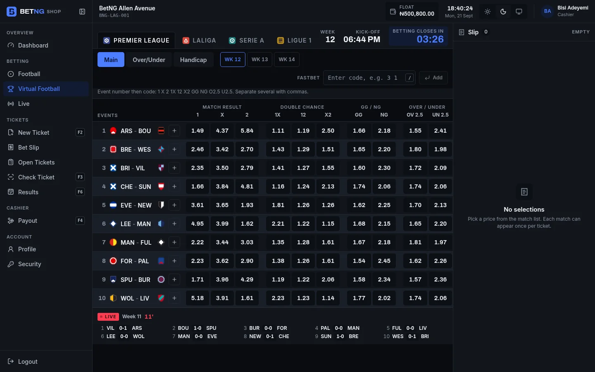<br><sub><b>Cashier week grid.</b> Every event and market in one table, with Fastbet codes and F-key shortcuts.</sub></td>
  </tr>
  <tr>
    <td>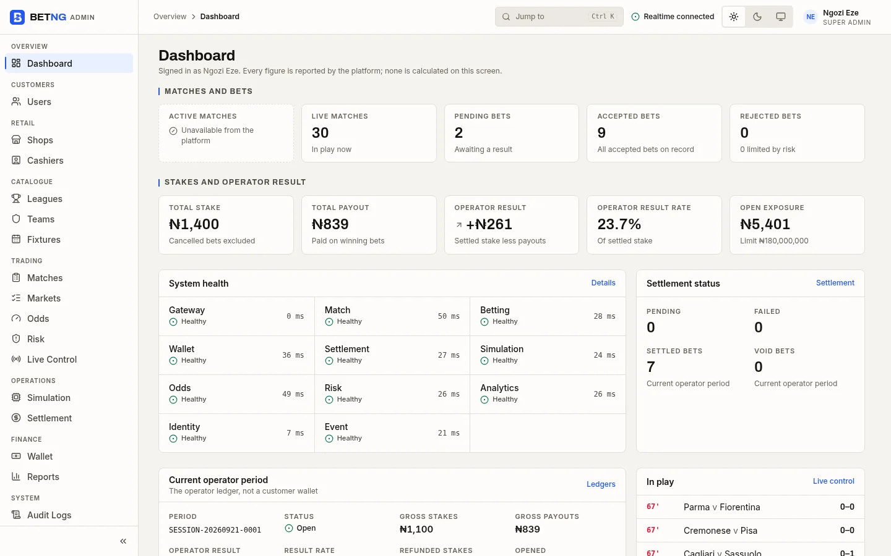<br><sub><b>Admin dashboard.</b> Platform figures only; a figure the platform does not supply says so.</sub></td>
    <td>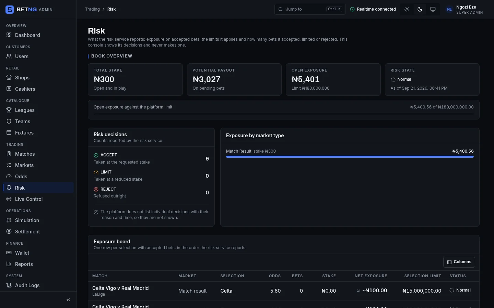<br><sub><b>Risk.</b> Exposure and decisions the risk service made. The console shows them and never makes one.</sub></td>
  </tr>
</table>

More screens of every client, in both themes, are in [`docs/frontend.md`](docs/frontend.md).

## Architecture

<picture>
  <source media="(prefers-color-scheme: dark)" srcset="docs/images/diagrams/system-dark.svg">
  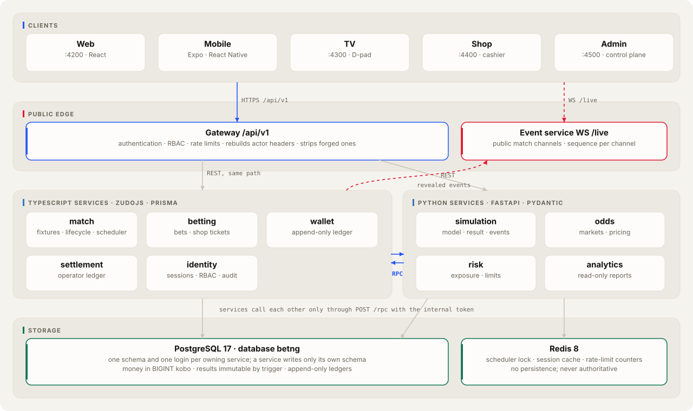
</picture>

- **Clients** reach exactly two addresses: the gateway (`/api/v1`) and the realtime endpoint (`WS /live`).
- **The gateway** authenticates, applies RBAC and rate limits, strips any forged identity headers and rebuilds them from the session.
- **Eleven services.** Each service that stores data owns one PostgreSQL schema and a login that can write only that schema (the gateway, event and analytics services own none). Services call each other only through `POST /rpc` with an internal token. TypeScript services run on [ZudoJS](https://zudojs.oyinlola.site) with Prisma; the simulation, odds, risk and analytics services are Python with FastAPI.
- **PostgreSQL** is authoritative. **Redis** holds locks, caches and rate-limit counters, and is never the source of truth.

### The life of a match

<picture>
  <source media="(prefers-color-scheme: dark)" srcset="docs/images/diagrams/lifecycle-dark.svg">
  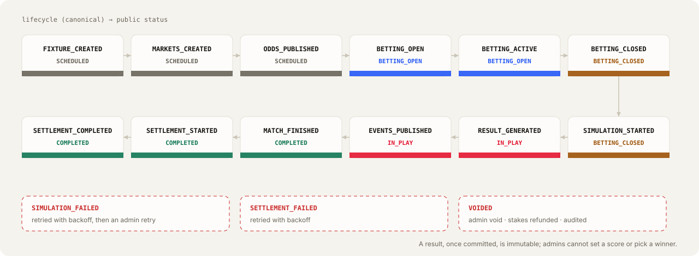
</picture>

Betting closes before the simulation starts, so no accepted bet can influence the result. The seed is an HMAC of the match with a server secret, so the result cannot be computed from the source code, and it is revealed only as the match clock reaches each event.

### Inside a client

<picture>
  <source media="(prefers-color-scheme: dark)" srcset="docs/images/diagrams/frontend-layers-dark.svg">
  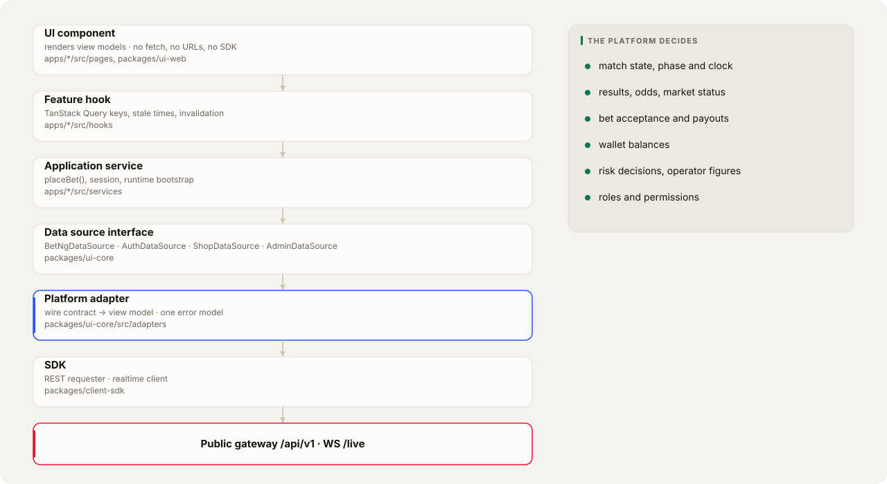
</picture>

Components never call `fetch`, build a URL or import the SDK. They render view models from a data-source interface whose platform adapter speaks to the gateway. A development stand-in implements the same interfaces for offline work and deterministic browser tests, and deployed bundles do not contain it.

## Technology

<picture>
  <source media="(prefers-color-scheme: dark)" srcset="docs/images/stack/stack-dark.svg">
  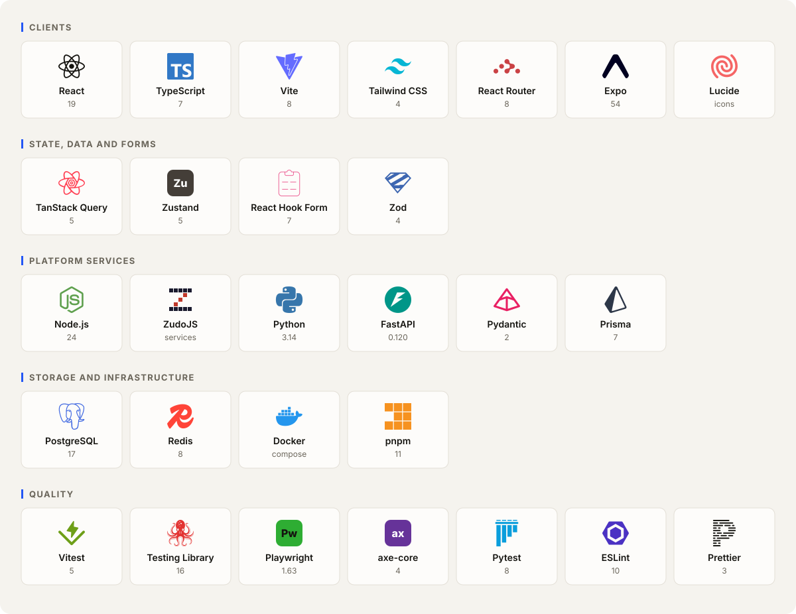
</picture>

| Layer | Choice | Why it is here |
| --- | --- | --- |
| Web, TV, shop, admin | React 19, Vite 8, React Router 8, Tailwind CSS 4 | One component library (`packages/ui-web`) across four browser apps |
| Mobile | Expo 54, React Native 0.81, react-native-svg | Same view models, crests and icons as the browser apps |
| Server state | TanStack Query 5 | Caching, stale times and invalidation from realtime signals |
| Client state | Zustand 5 | Only what is truly local: theme, bet slip draft, sheets |
| Forms | React Hook Form 7 and Zod 4 | Validation that matches the platform's own schemas |
| Contracts | Zod schemas in `packages/contracts` | One definition shared by services and clients |
| TypeScript services | Node.js 24, ZudoJS, Prisma 7 | Gateway, match, betting, wallet, settlement, identity, event |
| Python services | Python 3.14, FastAPI, Pydantic 2, psycopg 3 | Simulation, odds, risk, analytics |
| Storage | PostgreSQL 17, Redis 8 | One database with a schema per service; locks and counters |
| Quality | Vitest 5, Testing Library, Playwright, axe-core, Pytest, ESLint 10 | Unit, component, contract, browser and accessibility checks |
| Tooling | pnpm 11 workspaces, TypeScript 7, Docker Compose | One repository, strict types, reproducible infrastructure |

## Repository layout

```
apps/
  web/  tv/  shop/  admin/  mobile/     the five clients
  gateway/                              public API edge
  services/                             TypeScript services: match, betting, wallet, settlement, identity, event
services/                               Python services: simulation, odds, risk, analytics (+ shared kit)
packages/
  contracts/        wire contracts shared by services and clients
  client-sdk/       REST requester and realtime client (WebSocket / SSE)
  ui-core/          view models, data-source interfaces, platform adapters, money, dates, clock, env, logger
  ui-web/           React + Tailwind components for web, shop and admin
  design-tokens/    colour, type, spacing, motion and TV tokens -> TypeScript and CSS
  brand/            logo, league marks, the procedural crest system, football icon geometry
  mock-data/        development stand-in behind the same interfaces (never in production bundles)
  service-kit/      shared service plumbing
infrastructure/     Docker Compose, PostgreSQL bootstrap
scripts/            verification, platform launcher, smoke check, documentation renderers
e2e/                Playwright suites for the browser apps
docs/               architecture, design system, API, realtime, testing, invariants, analytics
```

## Getting started

### Prerequisites

Node.js 24, pnpm 11, Python 3.14, Docker (for PostgreSQL and Redis), and Chromium for the browser tests.

### Run the platform

```bash
cp .env.example .env
pnpm install
pnpm infra:up         # PostgreSQL :55432 and Redis :56379
pnpm db:bootstrap     # the betng database, schemas and logins (idempotent)
pnpm db:migrate       # Prisma migrations; Python services migrate themselves at start-up
pnpm py:install       # one virtualenv per Python service
pnpm dev              # every service from source: gateway :3000, live stream ws://localhost:3008/live
```

When port 3000 is taken, run the platform on another range:

```bash
E2E_DATABASE=betng E2E_BASE_PORT=3100 node scripts/e2e/serve.mjs
```

`pnpm platform:up` runs the same platform in Docker.

### Run the clients

```bash
pnpm build            # shared packages first
pnpm dev:web          # http://localhost:4200  customer web app
pnpm dev:tv           # http://localhost:4300  broadcast display (arrows, Enter, Escape)
pnpm dev:shop         # http://localhost:4400  cashier terminal
pnpm dev:admin        # http://localhost:4500  administration control plane
pnpm dev:mobile       # Expo
```

Point a client at the platform with `VITE_API_URL` and `VITE_WS_URL` (see `apps/*/.env.example`). To work without a platform, `VITE_DATA_SOURCE=mock` opts a development build into the in-process stand-in. Staging and production builds ignore it.

`node scripts/smoke-platform.mjs` reads a running platform through the same adapter the clients use, which is the quickest way to confirm a backend is reachable and speaking the right contract.

### Configuration

| Variable | Default | Meaning |
| --- | --- | --- |
| `VITE_API_URL` | `http://localhost:3000` | Public gateway origin |
| `VITE_WS_URL` | `ws://localhost:3008/live` | Public realtime endpoint |
| `VITE_APP_ENV` | `development` | `development`, `test`, `staging` or `production` |
| `VITE_DATA_SOURCE` | `platform` | `mock` opts a development or test build into the stand-in |
| `VITE_REALTIME_TRANSPORT` | `websocket` | `websocket` or `sse` |
| `VITE_REALTIME_AUTH` | `none` | `none`, `frame` or `query` |
| `VITE_FEATURE_FLAGS` | none | Build-time overrides such as `walletEnabled=false` |
| `VITE_REQUEST_TIMEOUT_MS` | `10000` | Per-request timeout |
| `VITE_LOG_LEVEL` | `info` | `warn` in deployed builds |
| `VITE_SITE_URL` | none | Web only: canonical and Open Graph URLs |

Platform settings (ports, database logins, the internal token, the simulation seed secret, CORS origins) live in `.env.example`, which documents each one. Production refuses to start with the placeholder secrets.

### Development sign-ins

With the development stand-in, the sign-in screens list these themselves:

| Client | Sign-in |
| --- | --- |
| Web, mobile | `demo@betng.test` / `betng-demo` |
| Shop | shop `BNG-LAG-001`, user `bisi` (cashier) or `ada` (owner), password `betng-demo`, PIN `1234` |
| Admin | `operations@betng.test`, `risk@betng.test`, `support@betng.test` / `betng-admin` |

Against a local platform the backend's seed provides the accounts; its super-admin account needs a real authenticator code.

### Scripts

| Command | What it does |
| --- | --- |
| `pnpm verify` | Builds the shared packages, typechecks and lints every client, runs the unit and component suites, builds four production bundles and checks none contains the stand-in |
| `pnpm test:unit` | Data layer, contracts, SDK, realtime, money, tokens, brand, stand-in |
| `pnpm test:dom` | Components and the four browser apps in jsdom |
| `pnpm test:e2e` | Playwright: desktop, mobile and TV projects |
| `pnpm test` | Every TypeScript suite, services included |
| `pnpm py:test` | The Python services' suites |
| `pnpm e2e` | The platform's end-to-end scenario against the real services on a throwaway database |
| `pnpm lint`, `pnpm format` | ESLint and Prettier across the workspace |

## Quality and proof

The numbers in the badges above come from these runs, recorded on 2026-09-21 and 2026-09-22. Every image is real command output, rendered from the log by `scripts/docs/render-terminal.mjs`.

| Suite | Result |
| --- | --- |
| Frontend unit, contract and data layer (`vitest run --project unit packages`) | 332 tests in 30 files |
| Mobile deep links, offline cache and crash-report redaction (`vitest run --project unit apps/mobile`) | 18 tests in 3 files |
| Components and apps in jsdom (`pnpm test:dom`) | 464 tests in 49 files |
| Browser end to end (`pnpm test:e2e`) | 34 tests across desktop, mobile and TV |
| TypeScript services (`vitest run --project unit apps/gateway apps/services`) | 537 tests in 37 files |
| Python services (`pnpm py:test`) | 1,192 tests across simulation, odds, risk and analytics |
| Platform scenario (`pnpm e2e`) | 22 of 22 steps |

<details open>
<summary><b>pnpm verify</b></summary>


</details>

<details>
<summary><b>The platform's end-to-end scenario</b></summary>


</details>

<details>
<summary><b>Browser end to end</b></summary>


</details>

<details>
<summary><b>The clients against the live platform</b></summary>


</details>

<details>
<summary><b>Service suites</b></summary>


</details>

## Documentation

| Document | What it covers |
| --- | --- |
| [`design.md`](design.md) | The visual and interaction reference every client is built from |
| [`docs/architecture.md`](docs/architecture.md) | Services, database ownership, wire conventions, match lifecycle, RPC, routes |
| [`docs/invariants.md`](docs/invariants.md) | The rules the platform keeps, what enforces each and the test that proves it |
| [`docs/analytics.md`](docs/analytics.md) | The definition of every reported figure |
| [`docs/frontend-architecture.md`](docs/frontend-architecture.md) | Client layers, canonical match model, state, bootstrap, authentication, errors |
| [`docs/design-system.md`](docs/design-system.md) | Tokens, components, the crest system, football icons, conventions |
| [`docs/api-integration.md`](docs/api-integration.md) | Environment, REST client, error model, bet submission, contract status |
| [`docs/realtime.md`](docs/realtime.md) | Realtime client, ordering, resynchronisation, connection state |
| [`docs/frontend-api.md`](docs/frontend-api.md) | Every route the clients call, with its status |
| [`docs/frontend.md`](docs/frontend.md) | Every screen of every client, with screenshots |
| [`docs/testing.md`](docs/testing.md) | Test layers, how to run them, what each proves |
| [`docs/frontend-backend-contracts.md`](docs/frontend-backend-contracts.md) | Shared contracts, who is authoritative for each value, error codes, routes pending on the backend |
| [`docs/frontend-api-matrix.md`](docs/frontend-api-matrix.md) | Per-screen wiring: route, permission, realtime signal, cache key, invalidation, status |
| [`docs/development.md`](docs/development.md) | Running each app, mock and API modes, environment, backend requirements |
| [`docs/deployment.md`](docs/deployment.md) | Frontend containers, CI workflows, approval-gated deploys |
| [`docs/security-headers.md`](docs/security-headers.md) | CSP and security headers delivered by the frontend servers |
| [`SECURITY.md`](SECURITY.md) | Reporting a vulnerability, and the security model with its evidence |

## Security

Please report vulnerabilities privately through GitHub's **Report a vulnerability** on the Security tab. [`SECURITY.md`](SECURITY.md) describes the trust boundary, how credentials, money and results are protected, and the test that proves each rule.

## Licence

[MIT](LICENSE) © 2026 Oluwayemi Oyinlola. Technology logos are from Simple Icons (CC0) and remain their owners' trademarks. The ZudoJS mark is used unaltered under its [brand rules](https://zudojs.oyinlola.site/brand).

<p align="center">
  <a href="https://zudojs.oyinlola.site">
    <picture>
      <source media="(prefers-color-scheme: dark)" srcset="docs/images/stack/zudo-logo-dark.svg">
      
    </picture>
  </a>
  <br>
  <sub>TypeScript services built with ZudoJS</sub>
</p>
