# Design System

Where the design in [`design.md`](../design.md) lives in code, and how to use it. `design.md` says what things should look like and why; this document says which token, class or component to reach for.

## 1. Packages

| Package | Holds |
| --- | --- |
| `@betng/design-tokens` | The source of every visual value, as TypeScript, plus the generated `css/tokens.css` (`--bn-*`). React Native reads the TypeScript; browsers read the CSS |
| `@betng/brand` | Logo, league marks, the crest system, the football icon geometry. Framework-free, so TV and mobile draw the same marks as web |
| `@betng/ui-web` | React + Tailwind 4 components for web, shop and admin, and `styles/theme.css`, which maps the tokens into Tailwind once |

An app's `styles/app.css` imports Tailwind, `@betng/ui-web/theme.css`, and scans `packages/ui-web/src`. Nothing else defines colour, type or spacing.

## 2. Tokens

`packages/design-tokens/src`:

| File | Exports |
| --- | --- |
| `color.ts` | `lightTheme`, `darkTheme` (`ColorTheme`): surfaces, three text levels, two borders, brand, focus ring, status pairs (`success`, `warning`, `danger`, `info`, `live`, `pending`, `void`, `suspended`, each with `…Subtle`), overlay, skeleton, chart `series1–3`; `StateTone` |
| `typography.ts` | `fontFamily`, `fontSize`, `fontWeight`, `lineHeight`, `letterSpacing`, and `typeRole` (display, h1–h3, sectionHeading, body, small, caption, data, score, odds, financial) |
| `layout.ts` | `spacing`, `radius`, `shadow`, `borderWidth`, `breakpoint`, `screen`, `zIndex`, `controlHeight`, `iconSize`, `crestSizes`, `minTouchTarget` |
| `motion.ts` | `duration`, `easing` |
| `tv.ts` | The ten-foot layer: `tvRootFontSize`, `tvType`, `tvCrest`, `tvLayout`, `tvMotion`; emitted as `--bn-tv-*` under `:root[data-surface="tv"]` |

Edit the TypeScript and run `pnpm --filter @betng/design-tokens build`; `css/tokens.css` is generated.

In components use the Tailwind names from `theme.css`, never a hex value or an arbitrary size:

- Colour: `bg-background`, `bg-surface`, `bg-surface-elevated`, `bg-surface-sunken`, `bg-surface-hover`, `text-text-primary | secondary | muted`, `border-border`, `border-border-strong`, `bg-brand`, `text-brand`, and every status as `text-*`, `bg-*-subtle`.
- Type roles: `type-display`, `type-h1`, `type-h2`, `type-h3`, `type-section`, `type-body`, `type-small`, `type-caption`, `type-data`, `type-score`, `type-odds`, `type-financial`. `tabular` for any other number.
- Shape: `rounded-sm` controls, `rounded-md` cards, `rounded-lg` dialogs. `shadow-sm | md | lg`.
- Motion: `animate-score-pop`, `animate-odds-up`, `animate-odds-down`, `animate-event-in`, `animate-fade-in`, `animate-slide-up`, `animate-toast-in`, `animate-pulse-live` (the live dot only).
- Utilities: `focus-ring`, `caps-label`, `skeleton`, `scrollbar-thin`, `z-sticky | z-drawer | z-sheet | z-modal | z-toast`.

Theme is `ThemeProvider` / `useTheme` (light, dark, system; persisted; `data-theme` on `:root`).

## 3. Components (`@betng/ui-web`)

| Folder | Components |
| --- | --- |
| `ui` | `Button`, `IconButton`, `Card`, `Panel`, `SectionHeader`, `Badge`, `StatusBadge` + `statusTone`, `Avatar`, `Input`, `PasswordInput`, `CodeInput`, `Textarea`, `Select`, `SearchInput`, `Checkbox`, `RadioGroup`, `Switch`, `Tabs` + `TabPanel`, `Dialog` / `Modal`, `Drawer`, `Sheet`, `BottomSheet`, `ConfirmationDialog` / `ConfirmDialog`, `Dropdown`, `Tooltip`, `DataTable`, `Pagination`, `KpiCard`, `ActivityFeed`, charts (`TimeSeriesChart`, `BarChart`, `RankedBars`, `Sparkline`), `Spinner` |
| `ui/skeletons` | `PageSkeleton`, `MatchSkeleton`, `TableSkeleton`, `MarketSkeleton`, `WalletSkeleton`, `BetSlipSkeleton`, `ProfileSkeleton`, `AdminSkeleton`, `ShopSkeleton`, plus `Skeleton`, `SkeletonRows` |
| `ui` states | `EmptyState` + `emptyPresets`, `ErrorState`, `LoadingState`, `OfflineState`, `UnauthorizedState`, `ForbiddenState`, `NotFoundState`, `MaintenanceState`, `SessionExpiredState`, `ConnectionStrip`, `StaleBadge` |
| `feedback` | `ErrorBoundary` (`scope`: global, route, feature), `RouteErrorBoundary`, `Toast`; `ToastProvider` / `useToast` |
| `forms` | `Field`, `FormError`, `FormActions`, `applyFieldErrors`, `useUnsavedChangesGuard` |
| `teams` | `TeamCrest`, `TeamAvatar`, `TeamBadge`, `TeamRow`, `TeamHeader`, `TeamComparison`, `TeamSelect`, `VirtualTeamCard` |
| `icons` | 23 football icons, `FootballIcon`, `eventIcon`, `eventTone` |
| `match` | `MatchCard` (+ `.Skeleton`, `.Error`), `Scoreboard`, `MatchTimeline`, `StatBar`, `StatComparison`, `StatGrid`, `StatsTable`, `StatsPanel`, `MatchLineups`, `LineupPitch`, `LineupList`, `PlayerRow`, `PlayerCard`, `HeadToHead` |
| `markets` | `OddsButton`, `SelectionButton`, `MarketCard`, `MarketRow`, `MarketGroup`, `MarketTabs`, `MarketList`, `MarketSuspendedState`, `MarketsEmpty` |
| `betslip` | `BetSlipSelection`, `BetSlipSummary`, `BetSlipStateView`, `BetReceipt` (presentation only; stores and submission live in the apps) |
| `standings` | `LeagueTable` (full, compact, tv), `StandingsCards`, `FormPips` |
| `domain` | `PhaseBadge`, `LiveDot`, `Countdown`, `PitchView`, `SectionHeading`, `PitchRule`, `ThemeSwitcher`, and the `MatchRow` / `LiveMatchCard` / `UpcomingMatchCard` wrappers over `MatchCard` |
| `brand` | `BrandLogo`, `LeagueMark` |
| `app` | `FeatureFlagsProvider`, `useFlag`, `FeatureGate`, `LoggerProvider`, `useLogger`, `installGlobalLogging` |
| `hooks` | `useNow`, `useMediaQuery`, `useElementWidth`, `useSession`, `useOnline`, `useDebouncedValue`, `useDocumentMeta` |

## 4. Crest system

`packages/brand/src/crest`. A `CrestSpec` is `shape × pattern × emblem` in the team's primary, secondary and accent colours: 8 shapes, 10 patterns, 12 emblems.

- `crestFor(team)` uses `team.crest` when the platform supplies fields and derives the rest from a stable hash of the team id, so every client and every viewer draws the same crest. No randomness.
- `detailFor(size)`: full from 40px, reduced from 24px, minimal below 24px.
- `crestLayers(spec, detail)` returns paint layers for any renderer; `crestSvg(spec, size)` returns a string. Colours that are not hex are replaced, never emitted.
- `TeamCrest` renders `team.crest.assetUrl` as an image when a licensed asset is supplied (http(s) or relative only, falling back to the generated crest on error), otherwise the generated crest as inline SVG. Sizes: 16, 20, 24, 32, 40, 48, 64, 80, 96, 128.

## 5. Football icons

Geometry lives in `packages/brand/src/footballIcons.ts` (`FOOTBALL_ICONS`, `FOOTBALL_EVENT_ICON`, `footballIconSvg`): 24×24, 1.75 stroke, round caps and joins, `currentColor`; card glyphs are filled with `warning` or `danger`. `ui-web`'s icon components render from that data, and TV and mobile draw it directly, so there is one definition of each glyph. `FootballIcon({ kind })` resolves a `MatchEventKind`; `eventTone(kind)` gives its colour class. Lucide covers every non-football interface icon. No emoji anywhere.

## 6. Conventions

- One component per file, PascalCase, named exports, a `<Name>Props` interface with `readonly` fields, return type `React.JSX.Element`.
- Variant maps are module-level `Record<Variant, string>` constants; classes are composed with `cn()`.
- Optional props are spread conditionally (`exactOptionalPropertyTypes` is on).
- Inline `style` only for values that come from data: team colours, grid columns.
- Every icon-only control uses `IconButton`, whose `label` is required.
- Status is a word or icon plus colour. `StatusBadge` and `statusTone(status)` do this for platform statuses.
- Platform ids are React keys for platform entities; never an array index.
- Comments are rare and explain why, not what.
- A component that needs data takes it as props. Nothing in `ui-web` fetches, and nothing in it knows a URL.

## 7. Adding to the system

1. A new value is a token first (`design-tokens`), then a Tailwind name in `theme.css`, then used.
2. A new component goes in the folder for its domain, is exported from that folder's `index.ts`, gets a test under `packages/ui-web/tests`, and is described in `design.md` if it changes how something looks or behaves.
3. An app keeps a component only when its interaction is genuinely specific to that app.

## Proof

Recorded on 2026-09-21. Screenshots are the apps running against the real platform; terminal images are real command output rendered by `scripts/docs/render-terminal.mjs`, and design sheets are rendered from the packages themselves by `scripts/docs/render-design-sheets.mjs`.

<table>
  <tr><td width="50%">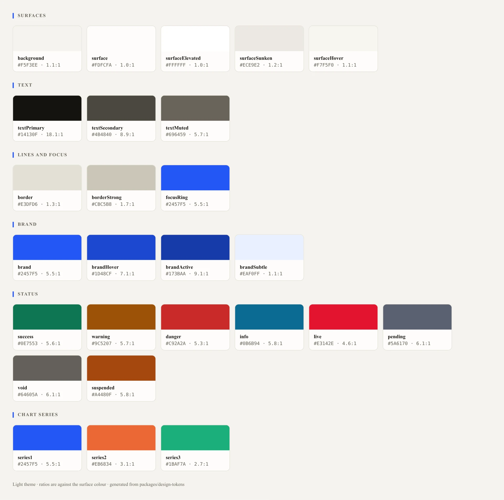 Colour tokens, light</td><td width="50%">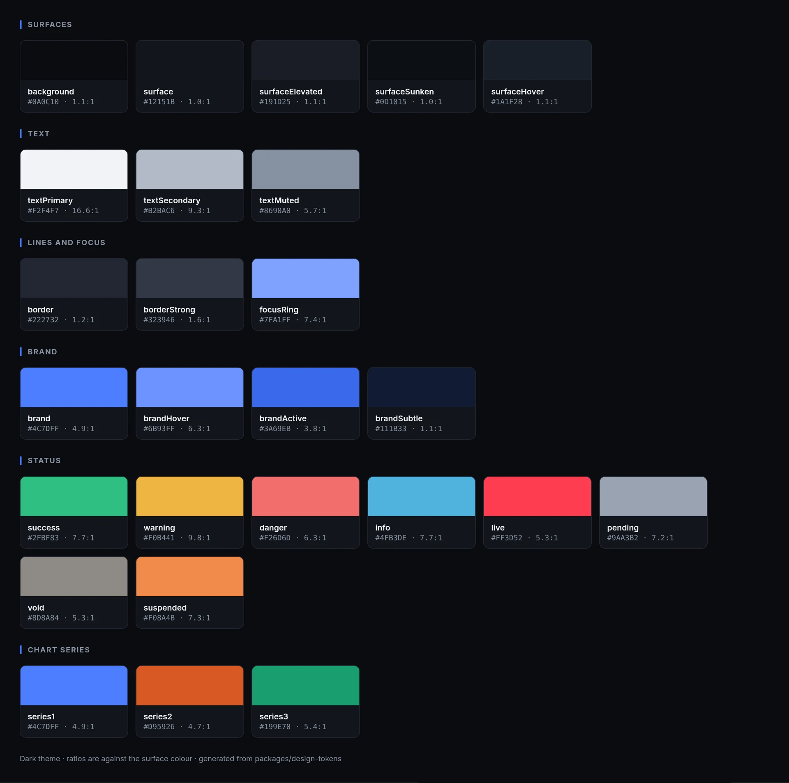 Colour tokens, dark</td></tr>
</table>

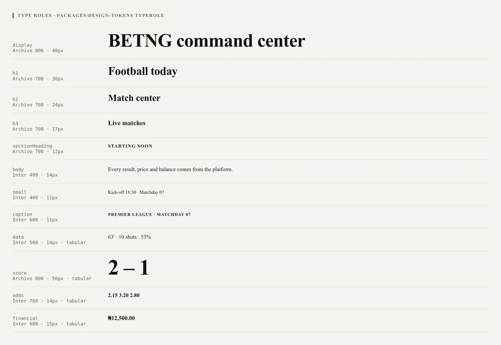

<table>
  <tr><td width="50%">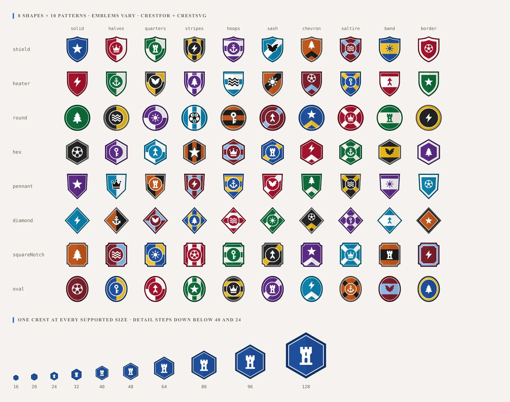 Crests, light</td><td width="50%">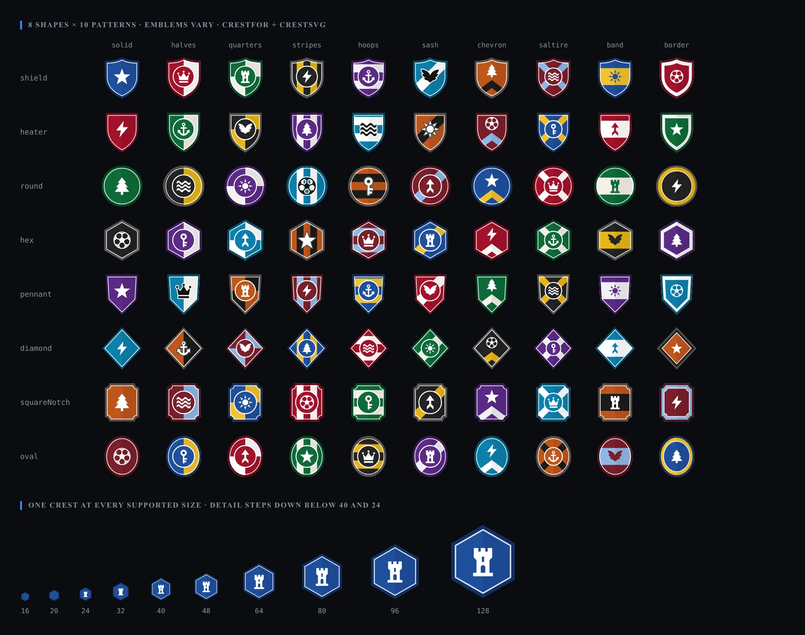 Crests, dark</td></tr>
  <tr><td width="50%">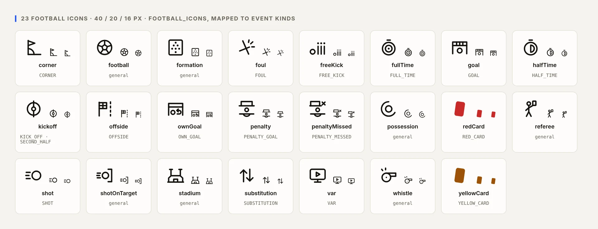 Icons, light</td><td width="50%">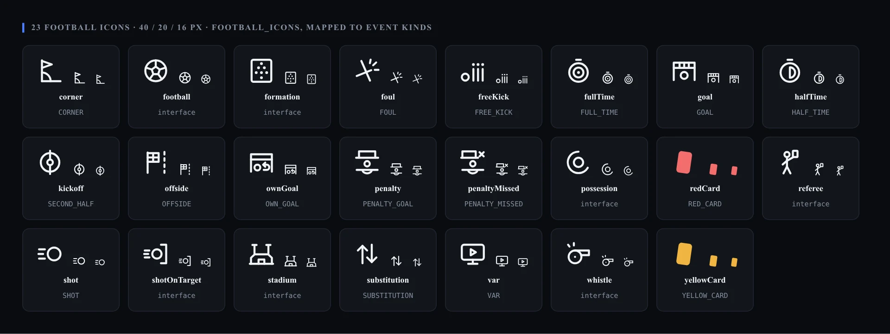 Icons, dark</td></tr>
</table>

The components in use, against the real platform:

<table>
  <tr><td width="50%">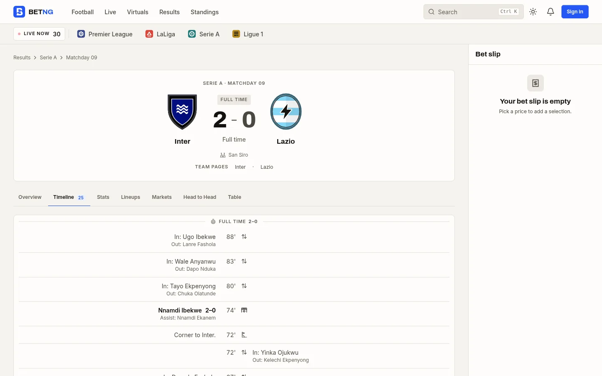 MatchTimeline with the football icons</td><td width="50%">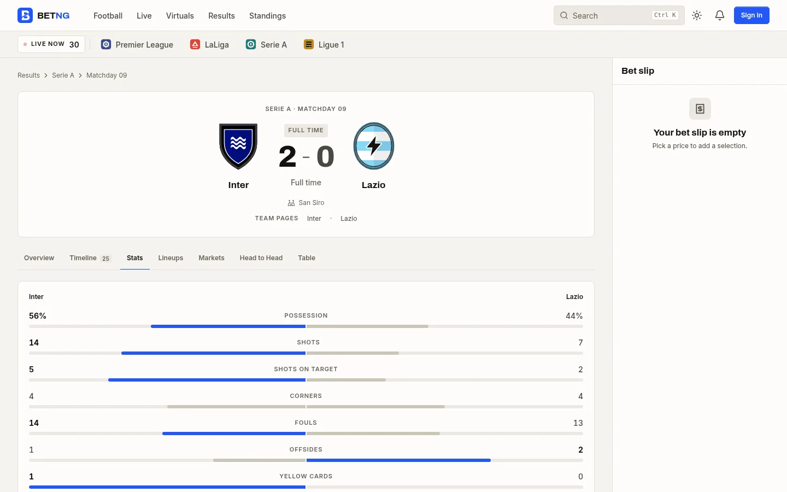 StatsPanel</td></tr>
  <tr><td width="50%">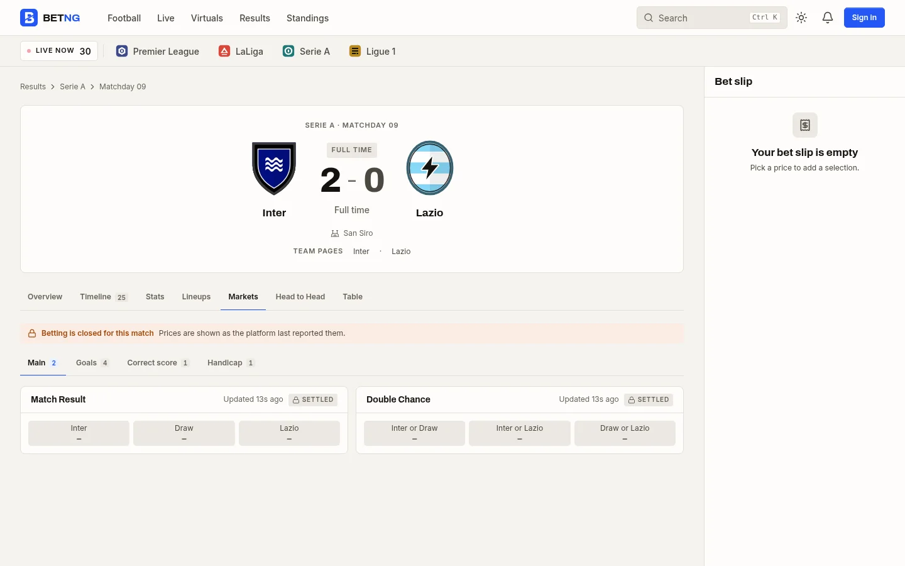 MarketList and OddsButton</td><td width="50%">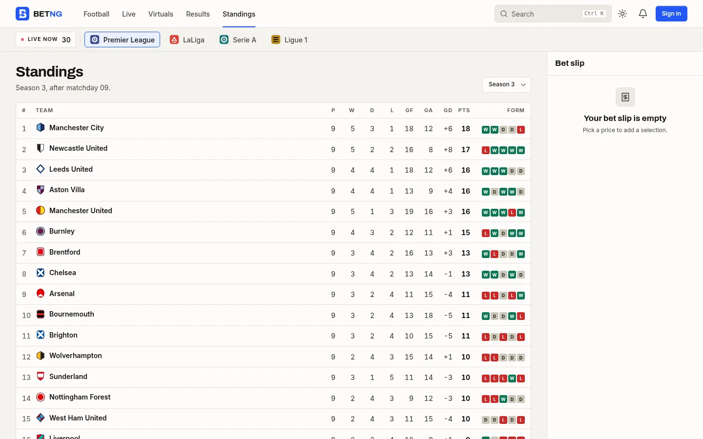 LeagueTable</td></tr>
  <tr><td width="50%">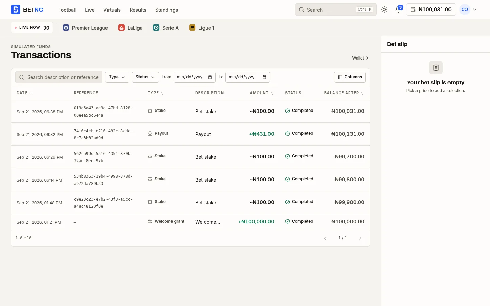 DataTable, server pages</td><td width="50%">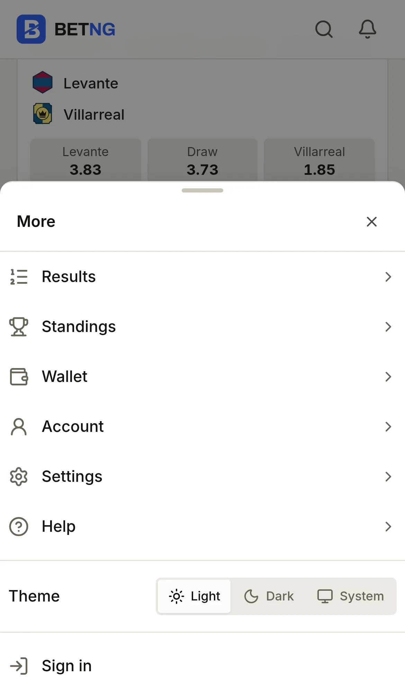 BottomSheet</td></tr>
</table>

