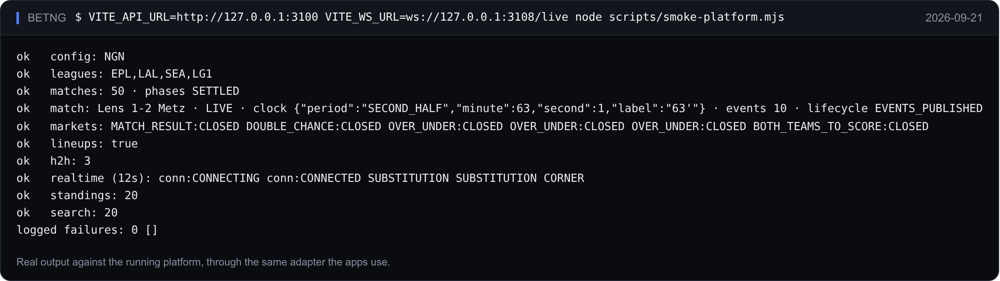
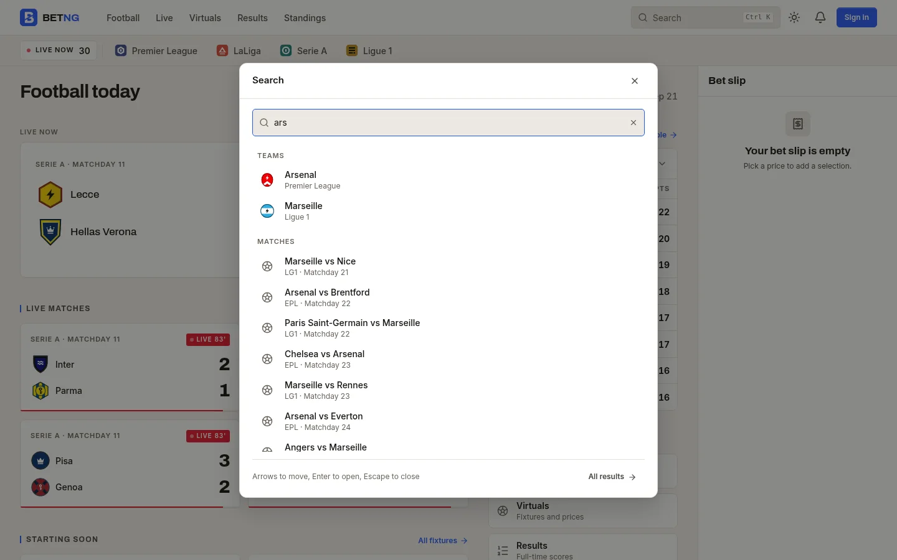
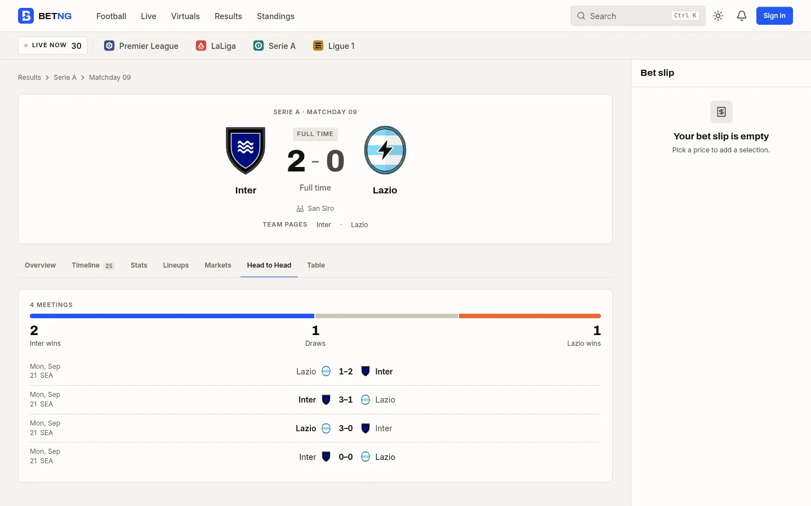
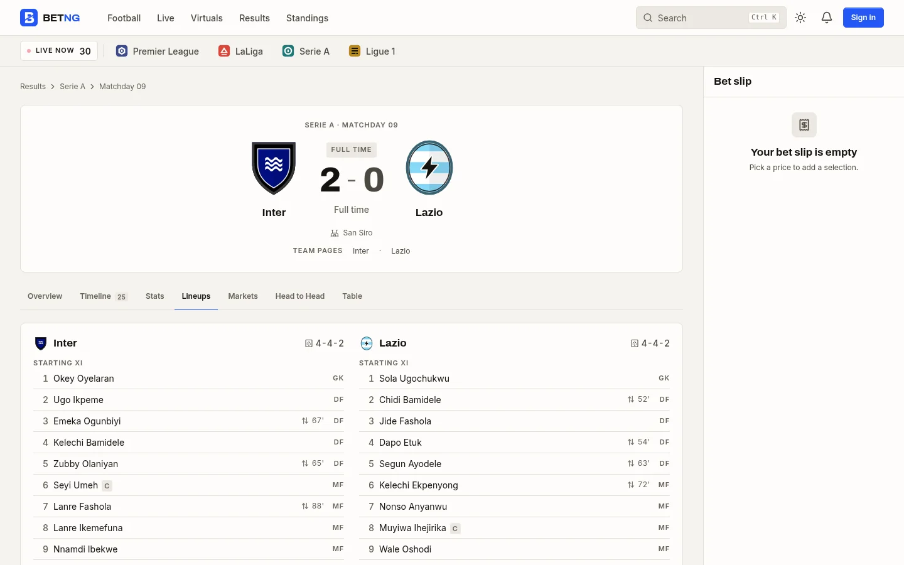
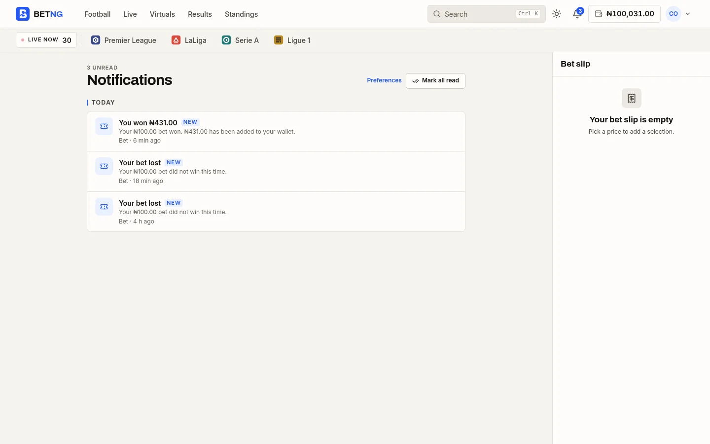
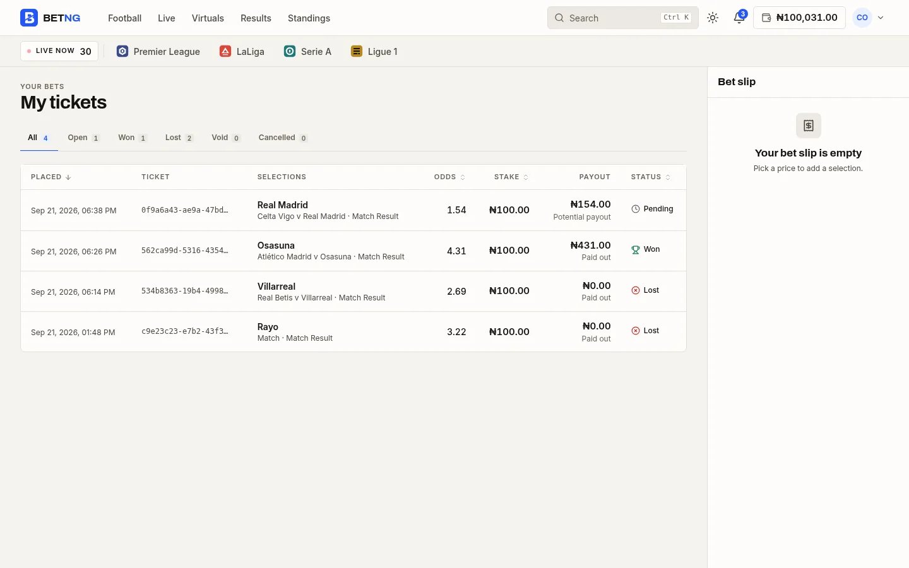

# Frontend → Platform API

Every public screen in web, mobile, TV, shop and admin reads matches, markets and tables through one interface, `BetNgDataSource` (`packages/ui-core/src/dataSource.type.ts`), implemented by `createPlatformDataSource` (`packages/ui-core/src/adapters/platformDataSource.ts`). It calls the gateway through `@betng/client-sdk` and subscribes to the event service over WebSocket. There is no other implementation outside tests.

Point an app at a platform with `VITE_API_URL` / `VITE_WS_URL` (browser apps) or `expo.extra.apiUrl` / `realtimeUrl` (mobile). Local development runs the platform (`pnpm dev`, or `scripts/e2e/serve.mjs`). Environment, error model and contract status: [`api-integration.md`](./api-integration.md); realtime: [`realtime.md`](./realtime.md).

All routes sit under `API_PREFIX = /api/v1`. Every response uses the envelope in `packages/contracts/src/common/envelope.type.ts`; list endpoints answer `{ items: T[] }`. Schemas referenced below live in `@betng/contracts`.

## Routes the frontend calls

| Method | Path                            | Query / body                                                                     | Response schema                                                                                                       | Owner                        | Status                                                                         |
| ------ | ------------------------------- | -------------------------------------------------------------------------------- | --------------------------------------------------------------------------------------------------------------------- | ---------------------------- | ------------------------------------------------------------------------------ |
| GET    | `/leagues`                      | —                                                                                | `League[]`                                                                                                            | match                        | served                                                                         |
| GET    | `/teams`                        | `leagueId?`                                                                      | `Team[]` — now with optional `city`, `stadium`, `colors`                                                              | match                        | served (new fields optional)                                                   |
| GET    | `/fixtures`                     | —                                                                                | `Fixture[]` — now with optional `season`                                                                              | match                        | served (new field optional)                                                    |
| GET    | `/matches`                      | `leagueId?`, `status?`, `season?`, `matchday?`, `from?`, `to?`, `limit?` (≤ 500)   | `Match[]`, each with `clock` once served; `truncated` when the window was cut                                         | match                        | served; the adapter pushes every filter down, one request per status           |
| GET    | `/matches/:id`                  | —                                                                                | `Match`                                                                                                               | match                        | served                                                                         |
| GET    | `/matches/:id/events`           | —                                                                                | `MatchEvent[]` (`matchEventSchema`, now incl. `CORNER`, `SECOND_HALF`, `player`, `secondaryPlayer`, `score`)          | match                        | served |
| GET    | `/matches/:id/stats`            | —                                                                                | `MatchStats` (`matchStatsSchema`)                                                                                     | match                        | served |
| GET    | `/matches/:id/odds`             | —                                                                                | `MatchOdds` — `marketTypeSchema` now includes `DOUBLE_CHANCE`, `CORRECT_SCORE`, `GOAL_SPREAD`; `Market.line` optional | odds                         | served (new kinds optional)                                                    |
| GET    | `/matches/:id/lineups`          | —                                                                                | `MatchLineups` (`matchLineupsSchema`)                                                                                 | match                        | served                                                 |
| GET    | `/matches/:id/head-to-head`     | —                                                                                | `HeadToHead` (`headToHeadSchema`)                                                                                     | match                        | served                                                 |
| GET    | `/search`                       | `q`, `kinds?`, `limit?`                                                          | `SearchResponse` (`searchResponseSchema`)                                                                             | match                        | served                                   |
| GET    | `/config`                       | —                                                                                | `PublicConfig` (`publicConfigSchema`) plus `timing`                                                                   | gateway                      | served                                          |
| GET    | `/leagues/:id/standings`        | `season?`                                                                        | `Standings` (`standingsSchema`)                                                                                       | match                        | served |
| GET    | `/leagues/:id/scorers`          | `season?`                                                                        | `TopScorer[]` (`topScorerSchema`)                                                                                     | match                        | served |
| POST   | `/bets`                         | `PlaceBetRequest`; header `idempotency-key: <clientReference>`                   | `Bet` (200 with the original bet on a repeated key)                                                                   | betting                      | served; refusals carry `error.data` (`maxStake`, `current`, `selectionIds`)    |
| GET    | `/bets`                         | `userId?`, `status?`                                                             | `Bet[]` — legs should carry `outcome`; bet should carry `payout`                                                      | betting                      | served; add `outcome`/`payout`                                                 |
| GET    | `/bets/:id`                     | —                                                                                | `Bet`                                                                                                                 | betting                      | served                                                                         |
| GET    | `/wallets/:userId`              | —                                                                                | `Wallet`                                                                                                              | wallet                       | served                                                                         |
| GET    | `/wallets/:userId/transactions` | `page?`, `pageSize?`, `types?`, `statuses?`, `from?`, `to?`, `search?`, `sort?`, `direction?` | `Page<Transaction>` (an unpaged `{ items }` is paged by the adapter)                                     | wallet                       | served, paged                                            |
| POST   | `/wallets/deposit`              | `DepositRequest`                                                                 | `{ wallet, transaction }`                                                                                             | wallet                       | served                                                                         |
| POST   | `/wallets/withdraw`             | `WithdrawRequest`                                                                | `{ wallet, transaction }`                                                                                             | wallet                       | served                                                                         |
| GET    | `/users/:id/notifications`      | —                                                                                | `Notification[]` (`notificationSchema`)                                                                               | identity | served |
| POST   | `/users/:id/notifications/read` | `MarkNotificationsReadRequest`                                                   | `204`                                                                                                                 | identity                     | served |

How the adapter treats a route that is not served yet: a `404`, `501` or `error.code = NOT_IMPLEMENTED` answer falls back to an empty value (`[]`, `undefined`) and the screen renders its empty state. Every other failure surfaces as a `DataSourceError` the screens present.

## Authentication, shop and admin routes

All of these are served. The gateway's route table (`apps/gateway/src/routes/gateway.table.ts`) is the authoritative list of paths, owning services and required permissions; `docs/architecture.md` describes the services behind them.

Rules every route below follows:

- The session token travels as `Authorization: Bearer <token>`. `401` (or `error.code = UNAUTHENTICATED | SESSION_EXPIRED`) ends the client session and shows the session-expired state; `403` / `FORBIDDEN` shows permission denied; `409` / `CONFLICT` means the resource changed (ticket already paid, market already suspended); `429` / `RATE_LIMITED` is surfaced on login forms.
- Sessions carry `permissions: string[]` resolved by the platform from the role (`shopPermissionSchema`, `adminPermissionSchema`). Clients only hide or disable UI from it. **Every route must enforce the permission server-side.**
- Every mutating admin or shop route takes a human `reason` where listed and must write an audit entry.
- The admin surface has no route that sets a score or picks a winner. Match operations are limited to `matchAdminActionSchema`; results only ever come from the simulation service.

### Customer auth (`/auth`) — web and mobile

| Method | Path                    | Body                      | Response              | Notes                                                                 |
| ------ | ----------------------- | ------------------------- | --------------------- | --------------------------------------------------------------------- |
| POST   | `/auth/register`        | `CustomerRegisterRequest` | `RegistrationPending` | Sends a six-digit code; no session until verified                     |
| POST   | `/auth/verify`          | `VerifyEmailRequest`      | `CustomerSession`     |                                                                       |
| POST   | `/auth/verify/resend`   | `{ email }`               | `204`                 | Rate limited                                                          |
| POST   | `/auth/login`           | `CustomerLoginRequest`    | `CustomerSession`     | `401` on bad credentials; unverified accounts answer `CONFLICT`       |
| POST   | `/auth/logout`          | —                         | `204`                 |                                                                       |
| GET    | `/auth/me`              | —                         | `CustomerProfile`     |                                                                       |
| POST   | `/auth/password/forgot` | `PasswordResetRequest`    | `204`                 | Always `204`, whether or not the address exists                       |

`/bets`, `/wallets/*` and `/users/:id/notifications` take the user from the token: a `userId` in a body is ignored, and a path id must be the caller's own (or `me`).

### Shop terminal (`/shop`) — cashier session required

| Method | Path                          | Query / body                                      | Response            | Permission          |
| ------ | ----------------------------- | ------------------------------------------------- | ------------------- | ------------------- |
| POST   | `/shop/auth/login`            | `ShopLoginRequest` (shop code, username, password, optional PIN) | `ShopSession` | —            |
| POST   | `/shop/auth/logout`           | —                                                 | `204`               | —                   |
| GET    | `/shop/auth/session`          | —                                                 | `ShopSession`       | —                   |
| POST   | `/shop/tickets`               | `PlaceTicketRequest`                              | `Ticket`            | `tickets:sell`      |
| GET    | `/shop/tickets`               | `status?`, `q?` (code, customer, phone), `date?`  | `{ items: Ticket[] }` | `tickets:check`   |
| GET    | `/shop/tickets/:code`         | —                                                 | `Ticket`            | `tickets:check`     |
| POST   | `/shop/tickets/:code/payout`  | `PayoutTicketRequest` (cashier PIN)               | `Ticket` (`PAID`)   | `tickets:payout`    |
| POST   | `/shop/tickets/:code/cancel`  | `CancelTicketRequest`                             | `Ticket`            | `tickets:cancel`    |
| GET    | `/shop/transactions`          | `date?`                                           | `{ items: ShopTransaction[] }` | `transactions:read` |
| GET    | `/shop/reports/daily`         | `date?`                                           | `ShopDailyReport`   | `reports:read`      |
| GET    | `/shop/reports/daily/range`   | `from`, `to`                                      | `{ items: ShopDailyReport[] }` | `reports:read` |
| GET    | `/shop/cashiers`              | —                                                 | `{ items: Cashier[] }` | `cashiers:read`  |

Payout must be idempotent per ticket: a second attempt answers `409` with the ticket in `PAID`. A ticket is payable only in `WON`; `VOID` refunds the stake through the same route. Tickets from another shop answer `404`.

### Admin control plane (`/admin`) — admin session required

| Method | Path                                                  | Query / body                                  | Response                       | Permission           |
| ------ | ----------------------------------------------------- | --------------------------------------------- | ------------------------------ | -------------------- |
| POST   | `/admin/auth/login`                                   | `AdminLoginRequest` (TOTP `code` when 2FA on) | `AdminSession`                 | —                    |
| POST   | `/admin/auth/logout`                                  | —                                             | `204`                          | —                    |
| GET    | `/admin/auth/session`                                 | —                                             | `AdminSession`                 | —                    |
| GET    | `/admin/overview`                                     | —                                             | `PlatformOverview`             | any                  |
| GET    | `/admin/health/services`                              | —                                             | `{ items: ServiceHealth[] }`   | `health:read`        |
| GET    | `/admin/users`                                        | `q?`                                          | `{ items: AdminCustomer[] }`   | `users:read`         |
| POST   | `/admin/users/:id/status`                             | `{ status, reason }`                          | `AdminCustomer`                | `users:write`        |
| GET    | `/admin/shops`                                        | —                                             | `{ items: AdminShopSummary[] }`| `shops:read`         |
| GET    | `/admin/shops/:id`                                    | —                                             | `AdminShopSummary`             | `shops:read`         |
| POST   | `/admin/shops`                                        | `CreateShopRequest`                           | `AdminShopSummary`             | `shops:write`        |
| PATCH  | `/admin/shops/:id`                                    | partial `CreateShopRequest`                   | `AdminShopSummary`             | `shops:write`        |
| POST   | `/admin/shops/:id/status`                             | `{ status, reason }`                          | `AdminShopSummary`             | `shops:write`        |
| GET    | `/admin/shops/:id/cashiers`                           | —                                             | `{ items: AdminCashierSummary[] }` | `shops:read`     |
| POST   | `/admin/shops/:id/cashiers`                           | `CreateCashierRequest`                        | `CashierCredentials` (shown once) | `cashiers:write`  |
| POST   | `/admin/shops/:id/cashiers/:cashierId/status`         | `{ status, reason }`                          | `AdminCashierSummary`          | `cashiers:write`     |
| POST   | `/admin/shops/:id/cashiers/:cashierId/reset-credentials` | —                                          | `CashierCredentials` (shown once) | `cashiers:write`  |
| GET    | `/admin/teams`                                        | `leagueId?`                                   | `{ items: AdminTeam[] }`       | `catalogue:read`     |
| PATCH  | `/admin/teams/:id`                                    | `UpdateTeamRequest`                           | `AdminTeam`                    | `catalogue:write`    |
| GET    | `/admin/fixtures`                                     | `leagueId?`, `matchday?`, `matchStatus?`      | `{ items: AdminFixture[] }`    | `fixtures:read`      |
| GET    | `/admin/matches/:id`                                  | —                                             | `AdminFixture`                 | `fixtures:read`      |
| POST   | `/admin/matches/:id/actions`                          | `MatchAdminActionRequest`                     | `AdminFixture`                 | `fixtures:operate`   |
| GET    | `/admin/odds`                                         | `matchId?`                                    | `{ items: AdminMarketOdds[] }` | `odds:read`          |
| POST   | `/admin/markets/:id/actions`                          | `MarketAdminActionRequest`                    | `AdminMarketOdds`              | `odds:write`         |
| GET    | `/admin/risk/overview`                                | —                                             | `RiskOverview`                 | `risk:read`          |
| GET    | `/admin/simulations`                                  | `status?`                                     | `{ items: AdminSimulationRun[] }` | `simulation:read` |
| POST   | `/admin/simulations/:id/actions`                      | `{ action: RETRY \| CANCEL, reason }`         | `AdminSimulationRun`           | `simulation:operate` |
| GET    | `/admin/settlements`                                  | `status?`                                     | `{ items: AdminSettlement[] }` | `settlement:read`    |
| POST   | `/admin/settlements/:id/retry`                        | `{ reason }`                                  | `AdminSettlement`              | `settlement:operate` |
| GET    | `/admin/wallet/overview`                              | —                                             | `PlatformWalletOverview`       | `wallet:read`        |
| GET    | `/admin/reports/daily`                                | `from`, `to`                                  | `{ items: PlatformReportDay[] }` | `reports:read`     |
| GET    | `/admin/audit`                                        | `AuditLogQuery`                               | `Page<AuditLogEntry>`          | `audit:read`         |
| GET    | `/admin/settings`                                     | —                                             | `PlatformSettings`             | `settings:read`      |
| PATCH  | `/admin/settings`                                     | partial `PlatformSettings` + `reason`         | `PlatformSettings`             | `settings:write`     |

Live Control reads the public `/matches` routes and the `WS /live` stream; it needs no admin-only route. The audit log must redact secrets in `before`/`after` server-side (password hashes, PINs, tokens); the client shows what it is given.

## Routes added with the platform

| Method | Path | Notes | Owner |
| --- | --- | --- | --- |
| GET | `/config` | `PublicConfig` plus `timing` | match |
| GET | `/results` | `leagueId?`, `limit?` → `CompletedMatch[]` with `result { homeGoals, awayGoals, winner, winningGap }` | match |
| GET | `/odds` | `matchIds=a,b,c` (≤ 60) → `{ items: MatchOdds[] }` | odds |
| GET | `/matches/:id/lineups`, `/matches/:id/head-to-head`, `/search` | shapes in `packages/contracts/src/discovery` | match |
| GET | `/wallets/:userId/transactions?page=…` | `transactionQuerySchema` → `Page<Transaction>`; unpaged call unchanged | wallet |
| GET/PUT | `/admin/risk/limits`, GET `/admin/risk/exposure` | `RiskLimits`, `MatchExposure[]` (`risk:read` / `risk:write`) | risk |
| GET | `/admin/analytics/overview`, `/breakdown`, `/sessions`, `/matches/:id`, `/accounts/:id`, `/shops/:id`, `/cashiers/:id` | `reports:read`; formulas in `docs/analytics.md` | analytics |
| GET/POST | `/admin/operator`, `/admin/operator/periods`, `/admin/operator/periods/close` | operator ledger (`settlement:read` / `settlement:operate`) | settlement |
| GET/PUT | `/admin/commission`, `/admin/commission/config` | commission ledger and its configuration | settlement |
| GET/PUT | `/admin/odds/config`, `/admin/simulation/config` | versioned pricing and model configuration | odds, simulation |
| GET/POST | `/admin/leagues`, `/admin/teams`, `/admin/fixtures` | catalogue and manual fixtures | match |

`GET /matches` and `GET /fixtures` are windowed (default: kick-off within ±30 minutes; `from`, `to`, `season`, `matchday`, `status`, `limit` ≤ 500), ordered by kick-off (descending for `status=COMPLETED`) and answer `truncated` when the window held more rows. `Match` carries `lifecycle` and the platform `clock`. Domain refusals carry `error.data`: `ODDS_CHANGED` → `current[]`, `STAKE_LIMITED` → `maxStake`, `MARKET_CLOSED` → `selectionIds[]`. `POST /bets` and `POST /shop/tickets` honour an `idempotency-key` header.

## Live stream (`WS /live`)

Protocol in `packages/contracts/src/realtime/liveProtocol.type.ts`; client in `packages/client-sdk/src/realtime` (see [`realtime.md`](./realtime.md)).

- Client sends `SUBSCRIBE { channel: "match:<matchId>" }`; server answers `SUBSCRIBED { lastSequence }`.
- Server pushes `EVENT { channel, event: LiveEvent }` with a strictly increasing per-match `sequence`, the running `score` and, when present, the platform `clock`.
- The frontend never trusts the stream as the source of truth: it reads `GET /matches/:id` (+ `/events`, `/stats`) first, applies events in sequence, and re-reads on a gap, on a lifecycle signal, at full time and after a reconnect (`packages/ui-core/src/live/watchMatch.ts`).
- Timeline frames (`KICKOFF`, `GOAL`, cards, `CORNER`, `SUBSTITUTION`, `HALF_TIME`, `SECOND_HALF`, `MATCH_FINISHED`) are appended to the match. Lifecycle frames (`BETTING_OPENED`, `BETTING_CLOSED`, `ODDS_UPDATED`, `SIMULATION_STARTED`, `SETTLEMENT_*`) only trigger a re-read.

## Match clock and phase

The clients take both from the platform. `Match.clock` (`period`, `minute`, `asOf`, optional `minuteLengthMs`) is served on `GET /matches`, `GET /matches/:id` and live frames; `GET /config` carries the round `timing`. `resolvePhase` (`packages/ui-core/src/phase.ts`) maps `Match.status`, `Match.lifecycle` and the clock period to the presentation phase, and takes no time input: `IN_PLAY` is `LIVE` until the platform reports half time, and `COMPLETED` is `SETTLED` only once the lifecycle says `SETTLEMENT_COMPLETED`. No client computes a minute from kick-off time. The match timing model lives only in the match service.

## Simulated-money rule

Every amount is play-money in kobo. The UI labels wallet, stake and return values as simulated; the platform must never wire these routes to a payment provider.

## Proof

Recorded on 2026-09-21. Screenshots are the apps running against the real platform; terminal images are real command output rendered by `scripts/docs/render-terminal.mjs`, and design sheets are rendered from the packages themselves by `scripts/docs/render-design-sheets.mjs`.

Every route above that the clients read, exercised through the platform adapter against the running platform:

<table>
  <tr><td width="50%"> `GET /search`</td><td width="50%"> `GET /matches/:id/head-to-head`</td></tr>
  <tr><td width="50%"> `GET /matches/:id/lineups`</td><td width="50%"> `GET /wallets/:userId/transactions?page=`</td></tr>
  <tr><td width="50%"> `GET /users/:id/notifications`</td><td width="50%"> `GET /bets`</td></tr>
</table>
