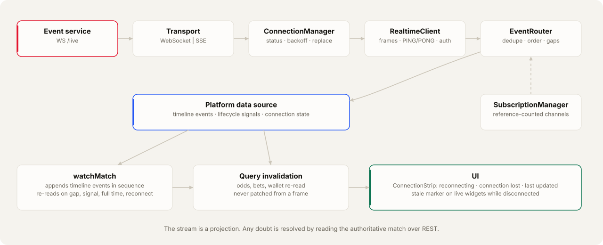

# Realtime

Live match events, odds changes and account updates reach the clients through one realtime client in `packages/client-sdk/src/realtime`. The stream is a projection, never the source of truth: a client that misses anything re-reads the authoritative state over REST and is correct again.

```
event service ──frames──▶ transport (WebSocket | SSE)
                            ↓
                        ConnectionManager     status, backoff, replace
                            ↓
                        RealtimeClient        frames → events, PING/PONG, auth
                            ↓
   SubscriptionManager ◀── EventRouter        dedupe, ordering, gap detection
                            ↓
              platform data source (ui-core)  timeline events · lifecycle signals · connection state
                            ↓
        watchMatch controller / query invalidation
                            ↓
                           UI
```

## Pieces

| Piece | File | Responsibility |
| --- | --- | --- |
| `RealtimeTransport` | `transports.ts` | `webSocketTransport()` (duplex) and `sseTransport()` (one-way; the channel list travels as `?channels=` and the stream is reopened when it changes). Chosen by `VITE_REALTIME_TRANSPORT` |
| `ConnectionManager` | `connectionManager.ts` | `CONNECTING → CONNECTED → RECONNECTING → FAILED`, plus `DISCONNECTED` when closed by the app. Exponential backoff with full jitter, 0.5s to 30s. `FAILED` after 8 consecutive attempts; it keeps retrying at the longest interval. `replace()` reopens for a renewed session |
| `SubscriptionManager` | `subscriptionManager.ts` | Reference-counted channels: requested once, released when the last listener leaves, all re-requested after every reconnect |
| `EventRouter` | `eventRouter.ts` | Delivers each event once. Drops a repeated event id, drops anything at or below a channel's last `sequence`, drops an older `version` of the same event type, and reports a gap when a sequence is skipped or the server acknowledges a later sequence than was delivered |
| `RealtimeClient` | `realtimeClient.ts` | Composes the above; answers `PING` with `PONG`; sends the session token (`VITE_REALTIME_AUTH`); reports `UNAUTHENTICATED` / `SESSION_EXPIRED` frames to the session store |

Protocol frames are the ones in `packages/contracts/src/realtime/liveProtocol.type.ts`: client `SUBSCRIBE`, `UNSUBSCRIBE`, `PONG`; server `WELCOME`, `SUBSCRIBED { lastSequence }`, `UNSUBSCRIBED`, `EVENT { channel, event }`, `PING`, `ERROR`.

## Events

`RealtimeEventType` is the contract's `LiveEventType` plus the account and system events: `MATCH_UPDATED`, `MATCH_STARTED`, `MATCH_EVENT`, `GOAL`, `CARD`, `SUBSTITUTION`, `ODDS_UPDATED`, `MARKET_UPDATED`, `MATCH_FINISHED`, `BET_UPDATED`, `WALLET_UPDATED`, `NOTIFICATION_CREATED`, `SYSTEM_STATUS_UPDATED`.

An event is identified by `eventId` / `id` when the platform sends one, otherwise by `channel#sequence`. Ordering uses `sequence` per channel, then `version` per event type, so a stale frame never overwrites newer state.

The platform data source splits a match channel in two:

- **Timeline events** (`KICKOFF`, `GOAL`, cards, `CORNER`, `SUBSTITUTION`, `HALF_TIME`, `SECOND_HALF`, `MATCH_FINISHED`) are appended to the match by the `watchMatch` controller, which also takes the running score, the clock period and the minute from them.
- **Lifecycle signals** (`BETTING_OPENED`, `BETTING_CLOSED`, `ODDS_UPDATED`, `MARKET_UPDATED`, `SIMULATION_STARTED`, `SETTLEMENT_STARTED`, `SETTLEMENT_COMPLETED`, `MATCH_UPDATED`) carry no state the client trusts. Each one triggers a re-read of the match; apps also invalidate the odds, bet and wallet queries they affect.

Account data (bets, wallet, notifications) has no realtime channel yet: the stream carries public match channels only. Until the event service authenticates connections, `subscribeAccount` re-reads on a 20 second timer and after every user action; when it does, setting `accountChannel: true` on the platform data source moves the same callback to `user:{id}` with no change in the apps. Balances, bet states and odds are always re-read, never patched from a frame.

## Resynchronisation

`watchMatch` (`packages/ui-core/src/live/watchMatch.ts`) re-reads the authoritative match:

1. when it starts;
2. when a sequence gap is seen, by the router or by the controller itself;
3. on every lifecycle signal;
4. at full time, when statistics and the result are final;
5. after every reconnect.

A later re-read supersedes an earlier one still in flight. An event the re-read already contained is not appended twice.

## Connection state in the UI

`ConnectionState` is `CONNECTING | CONNECTED | RECONNECTING | OFFLINE | FAILED`. While the connection is down the UI does not present live data as current: `ConnectionStrip` shows *Reconnecting* or *Connection lost* with *Last updated …*, live widgets show a stale marker, and the displayed minute stops advancing beyond the platform's last report plus its declared minute length. On recovery the state is re-read before the indicator clears.

## Polling

Match pages are pushed. Lists use TanStack Query with stale times and keep previous data while refreshing; intervals are modest (tens of seconds) because a realtime signal invalidates the relevant query. Nothing polls faster than it needs to, and nothing polls while the tab is hidden.

## Status with the backend

| Item | Status |
| --- | --- |
| Public match channels, `sequence` per channel, `SUBSCRIBED.lastSequence`, `PING`/`PONG` | served; this is what the client runs on today |
| `clock` on timeline frames (`event.clock`) | served; `watchMatch` prefers it over the clock it infers from the event |
| Event identity | no `eventId` on frames; identity is `channel#sequence` |
| `version` on `ODDS_UPDATED` / `MARKET_UPDATED` | not sent; an odds signal triggers a re-read, so ordering cannot go wrong |
| Authenticated connections, `user:{id}` and `system` channels | not planned in the current backend pass. Keep `VITE_REALTIME_AUTH=none`. The client already supports `frame` (an `AUTH { token }` first frame) and `query` (`?access_token=`) for when they are |
| SSE | the client supports it (`VITE_REALTIME_TRANSPORT=sse`, `GET <VITE_WS_URL>?channels=a,b` streaming the same `EVENT` frames as JSON `data:` lines); the event service serves WebSocket only |
| Public endpoint | reached directly today (`:3008/live`); it belongs behind the public edge with the gateway's origin and rate rules |

## Tests

`packages/client-sdk/tests/realtime.test.ts` (status walk, backoff stop on close, resubscribe after reconnect, `PONG`, exactly-once and in-order delivery, gap report, version ordering, channel release, frame and query authentication, rejected session, connection replacement, SSE reopen on channel change), `packages/ui-core/tests/watchMatch.test.ts` (phase from events alone, duplicates ignored, the five resync triggers, no double append) and `packages/ui-core/tests/platformDataSource.test.ts` (timeline versus signal routing, desync to `MATCH_UPDATED`).

## Proof

Recorded on 2026-09-21. Screenshots are the apps running against the real platform; terminal images are real command output rendered by `scripts/docs/render-terminal.mjs`, and design sheets are rendered from the packages themselves by `scripts/docs/render-design-sheets.mjs`.

<picture>
  <source media="(prefers-color-scheme: dark)" srcset="images/diagrams/realtime-dark.svg">
  
</picture>


Live frames arriving from the running platform through the same client (`realtime (12s)` line):


The minute, score and events on screen come from the platform's clock and stream:

<table>
  <tr><td width="50%"><br><sub>TV: live events</sub></td><td width="50%"><br><sub>Admin: realtime connected</sub></td></tr>
</table>
