# Testing

Four layers, each catching what the one below cannot. None of them talks to a real backend; the platform's own suites and `pnpm e2e` cover that side.

| Layer | Runner | Where | Run |
| --- | --- | --- | --- |
| Unit | Vitest, node | `packages/*/tests/**/*.test.ts`, `apps/mobile/tests/**/*.test.ts` | `pnpm test:unit` |
| Component and integration | Vitest, jsdom, Testing Library | `packages/ui-web/tests/**`, `apps/{web,shop,admin,tv}/tests/**` | `pnpm test:dom` |
| Contract | Vitest, node | `packages/contracts/tests/wire.test.ts` + `wireFixtures.ts` | part of `pnpm test:unit` |
| End to end | Playwright (desktop, mobile, TV projects) | `e2e/**` | `pnpm test:e2e` |

`pnpm verify` runs the package builds, every client's typecheck, lint, the unit and component projects, the four production builds, and a check that no production bundle references `VITE_DATA_SOURCE`, `createMock`, `betng-demo` or `demo@betng.test`.

## Configuration

- `vitest.config.ts` defines two projects. `unit` runs in node. `dom` runs in jsdom with `packages/ui-web/tests/support/setup.ts` (jest-dom matchers, cleanup after each test, `dialog` and `matchMedia` shims).
- Test folders have their own `tests/tsconfig.json`, so tests are type-checked and the type-aware linter can see them. `packages/ui-web/tests/support/jest-dom.d.ts` declares the matcher types for Vitest; app test projects include it.
- `playwright.config.ts` runs `e2e/support/global-setup.ts`, which starts the platform (`e2e/support/platform-stack.mjs`: every service from source through `scripts/e2e/stack.mjs`, on ports 3700–3710, a freshly reset `betng_e2e_ui` database, Redis db 5, the identity demo seed with a per-run admin TOTP secret, the `serve.mjs` match clock with two upcoming rounds) or reuses one already serving there, and waits until it has scheduled matches. It starts the four Vite dev servers on their usual ports with `VITE_APP_ENV=test`, `VITE_API_URL` and `VITE_WS_URL` pointed at that gateway, and uses the system Chromium when there is one (`PLAYWRIGHT_CHROMIUM_PATH` overrides it). Projects: `desktop` (1440×900), `mobile` (`*.mobile.spec.ts`, Pixel 7) and `tv` (`*.tv.spec.ts`, 1920×1080, dark).

## What is covered

### Unit

| Area | File | Proves |
| --- | --- | --- |
| Money | `ui-core/tests/money.test.ts` | formatting from minor units without floats, currency configuration, digit-by-digit parsing, integer estimates where float multiplication drifts |
| Clock and phase | `ui-core/tests/clockPhase.test.ts` | the displayed minute comes from the platform's clock, advances only with a declared minute length and never past the period; phase resolution takes no time input |
| Flags and logger | `ui-core/tests/flagsLogger.test.ts` | override precedence; redaction of credentials, tokens, financial and personal fields; a failing sink cannot break a caller |
| Environment | `ui-core/tests/clientEnv.test.ts` | defaults, variable names, malformed and insecure configuration reported |
| Errors | `ui-core/tests/errors.test.ts` | every status and platform code maps to one `DataSourceError` code; a 5xx never shows the server's words; field errors and retry delay survive |
| Platform adapter | `ui-core/tests/platformDataSource.test.ts`, `platformAdmin.test.ts`, `platformShop.test.ts` | clock from platform events, preferred platform clock, pacing from configuration, bet submitted once with the client reference as idempotency key, refusals returned and transport failures thrown, limited stake, timeline versus lifecycle routing, graceful degradation for unserved routes, paging fallbacks |
| Live controller | `ui-core/tests/watchMatch.test.ts` | phase changes from events alone, duplicates ignored, the five resynchronisation triggers, no double append, the event's own clock preferred |
| Bet slip, Fastbet, standings, sessions | `ui-core/tests/*` | slip rules and display maths, code parsing, table computation, session persistence and expiry |
| REST requester | `client-sdk/tests/request.test.ts`, `resilience.test.ts` | bearer token per request, 204, 401 reporting, status mapping without an envelope, no proxy HTML leaks, `retry-after`, reads retried and writes never, idempotency header, offline and timeout kinds |
| Realtime | `client-sdk/tests/realtime.test.ts` | status walk including `FAILED`, no retry after close, resubscribe after reconnect, `PONG`, exactly-once in-order delivery, gap and acknowledgement desync, version ordering, channel release, token by frame and by query, rejected session, connection replacement, SSE reopen |
| Crests and icons | `brand/tests/*` | deterministic specs, spread across shapes and patterns, platform overrides, invalid overrides and colours, no text in a crest, the full icon set and event mapping |

### Contract

`wire.test.ts` parses the payloads the clients are built against (match, fixture, markets and odds, bet request and response, wallet, transaction, settlement, error envelope, match clock, lineups, head to head, search, public configuration, every live frame type) with the platform's own zod schemas. A schema change that would break a client fails here first. It also asserts that money is integral and that a bet request cannot carry a client-decided outcome or payout.

### Component and integration

`packages/ui-web/tests/ui`: buttons, icon-button names, `DataTable` (sort and `aria-sort`, server pagination, states, row actions, keyboard rows, card renderer), tabs and panels, dialogs and confirmation with a required reason, toasts and their live regions, exhaustive `presentError`, error boundaries and reset, form field wiring and backend field errors, connection strip states, document metadata.

`packages/ui-web/tests/domain`: `MatchCard` in every phase (minute from the clock, `LIVE` with no minute when there is no clock, winner emphasis, interrupted states, skeleton, error), timeline ordering and period dividers, `OddsButton` states and change detection, market grouping from data and unknown market kinds, stats omitting absent metrics, lineups unavailable, unconfirmed and partial, head to head, standings, slip labels (*Estimated return* before acceptance, *Potential payout* after).

`apps/*/tests`: each app against fake data sources implementing the `ui-core` interfaces: navigation and flags, authentication and permission states, match rendering and live updates, bet slip and submission flow, wallet and transactions, results and standings filters in the URL, shop and admin authorisation states, confirmations before destructive actions, and the scan that no admin route offers a control that sets a score or a winner.

### End to end

`e2e/support/fixtures.ts` fails any test whose page logs an error or warning, throws, or makes a failing request, and provides the axe (WCAG 2.1 A/AA, serious and critical) and horizontal-overflow checks.

| Spec | Project | Covers |
| --- | --- | --- |
| `web.spec.ts` | desktop | header and league bar built from platform data; search through the platform (button and Ctrl+K); the match center tabs; a bet from a price to a platform-accepted ticket, with sign-in on the way, the slip kept, a moved price accepted before placing, then tickets and transactions; standings and results filters in the URL; the private-page gate and the 404; accessibility on home and a match in both themes |
| `web.mobile.spec.ts` | mobile | bottom navigation and the More sheet; the sticky slip bar opening the slip sheet; 44px touch targets; no horizontal scroll at 412px and at 320px on every main surface; accessibility on Live |
| `shop.spec.ts` | desktop | the sign-in gate and a refused sign-in; a sale from an open week to the platform's ticket and a check of that reference; a cashier denied reports; an owner through every area; accessibility on the dashboard |
| `admin.spec.ts` | desktop | the second factor; every one of the 19 areas opened with no error state and no control that sets a score or a winner; an operator without a second factor kept out of the console (the support-role permission check is `test.fixme` until operators can enrol a second factor); a destructive action behind a confirmation that needs a reason; accessibility on the dashboard in both themes |
| `tv.tv.spec.ts` | tv | every route (including Broadcast) with no betting, text input or account controls; the remote (arrows move focus, Enter opens, Back returns); no overflow and readable type at 1080p; accessibility on Home and Table |

The suite runs against the real platform with the seeded demo accounts (listed in [`development.md`](./development.md#demo-accounts)); the super admin signs in with codes from the run's TOTP secret, one 30-second step per sign-in because the platform accepts each step once. A test that provokes a failing response lists it in the `problems.expected` fixture; any other failed request or console error fails the test. To keep one stack across runs, start it by hand (`E2E_STATE_FILE=scripts/e2e/.logs/ui-stack.json E2E_ADMIN_TOTP_SECRET=<32 base32 chars> E2E_BASE_PORT=3700 E2E_DATABASE=betng_e2e_ui E2E_REDIS_URL=redis://localhost:56379/5 node e2e/support/platform-stack.mjs`).

### Production readiness additions

| Area | File | Proves |
| --- | --- | --- |
| SDK contracts | `client-sdk/tests/accountClient.test.ts` | idempotency keys are the caller's; float amounts, unknown payment statuses, unmasked account numbers, pages without paging fields and `javascript:` upload URLs are rejected as malformed; ids are escaped in paths; a bank account is saved without a client-supplied name; financial commands are never retried; cookie mode sends credentials and echoes CSRF only on state-changing requests |
| Account services | `ui-core/tests/accountServices.test.ts` | unserved routes become `NOT_IMPLEMENTED` with the request id kept; 401 ends the session; KYC files of the wrong type or to an untrusted host never upload; a 2FA challenge does not start a session; safe return paths and checkout host allowlists; cookie sessions persist no credential; env flag and host parsing; session monitor warning and refresh |
| Web money flows | `apps/web/tests/money/**` | deposit state machine, redirect allowlist, key reuse per attempt, withdrawal never completes before `CONFIRMED`, KYC upload checks and progress, limits pending vs active, self-exclusion confirmation, flag-off and `NOT_IMPLEMENTED` states, rate-limit wording |
| Web security and shell | `apps/web/tests/{auth,account,shell}/**` | 2FA sign-in (TOTP and backup code), unsafe return paths land on `/`, password reset, backup codes shown once, session revocation confirmation, deletion never shown before `COMPLETED`, timeout warning and refresh, private caches cleared on sign-out, footer legal links, legal placeholders |
| Admin | `apps/admin/tests/{compliance,safety}/**` | compliance nav gated by flag and permission, KYC and withdrawal decisions need a reason and confirmation, URL filters round-trip, https-only previews, 2FA blocking notice, no winner/score/force control anywhere |
| Shop | `apps/shop/tests/{pages,services,hooks}/**` | shift key reuse, platform discrepancy shown instead of a client sum, permission gating, ESC/POS encoding, printer bridge restricted to localhost, wedge scanner vs typing, shortcuts ignore fields |
| TV and mobile | `apps/tv/tests/**`, `apps/mobile/tests/**` | focus never lost, stale data marked after 20 s; deep-link parsing refuses unsafe input, crash-report redaction, offline cache never stores money commands |

## Conventions

- Test the interface, not the network: a fake `BetNgDataSource` / `AdminDataSource` / `ShopDataSource`, never `fetch` mocks in app tests.
- Query by role and accessible name. `data-testid` only where neither is practical.
- Time is injected (`now` props, fake timers). No test sleeps.
- A bug fix comes with the test that would have caught it.

## Proof

Recorded on 2026-09-21. Screenshots are the apps running against the real platform; terminal images are real command output rendered by `scripts/docs/render-terminal.mjs`, and design sheets are rendered from the packages themselves by `scripts/docs/render-design-sheets.mjs`.

| Suite | Result |
| --- | --- |
| `vitest run --project unit packages` (inside `pnpm verify`) | 332 tests in 30 files |
| `vitest run --project unit apps/mobile` | 18 tests in 3 files |
| `pnpm test:dom` | 464 tests in 49 files |
| `pnpm test:e2e` | 34 tests (desktop, mobile, TV) |
| TypeScript services | 537 tests in 37 files |
| Python services | 1,192 tests |
| `pnpm e2e` (platform scenario) | 22 of 22 steps |

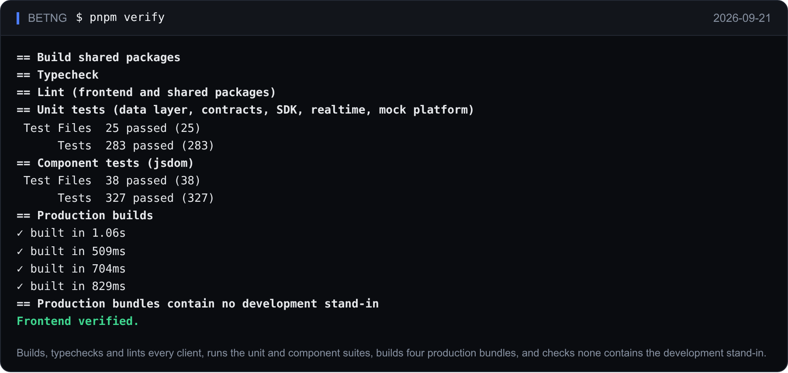

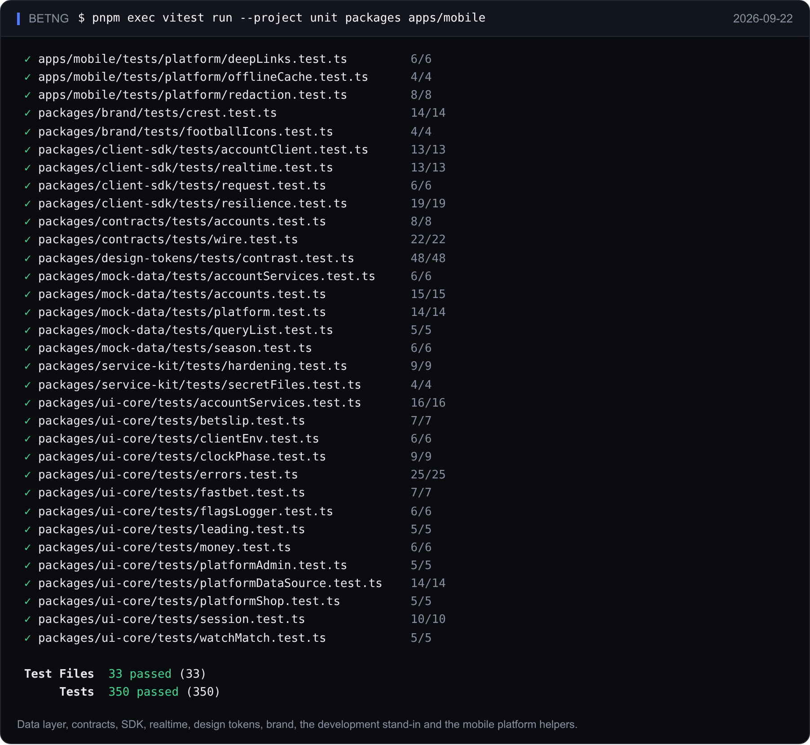

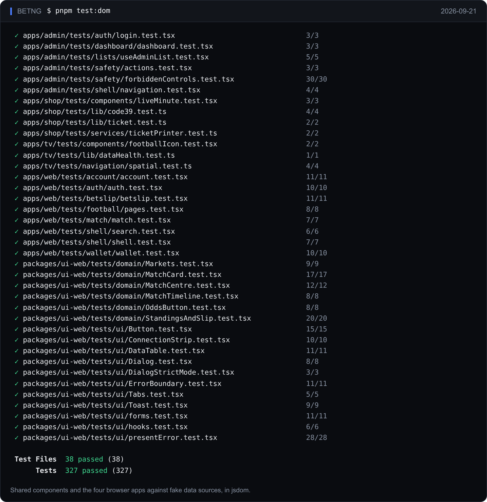

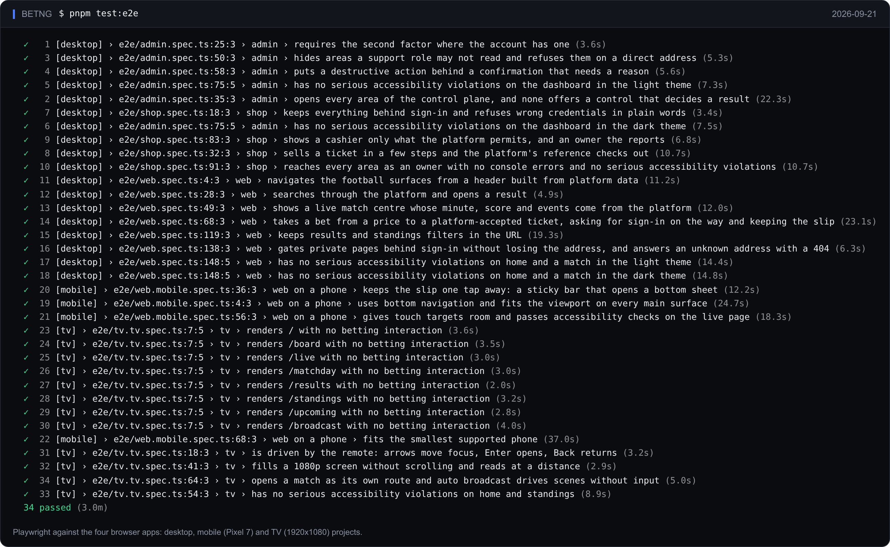

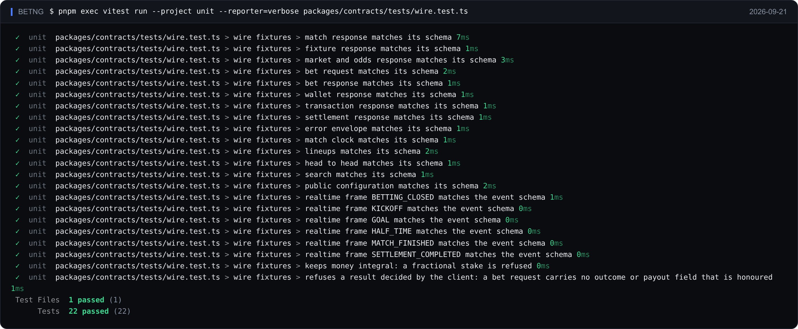

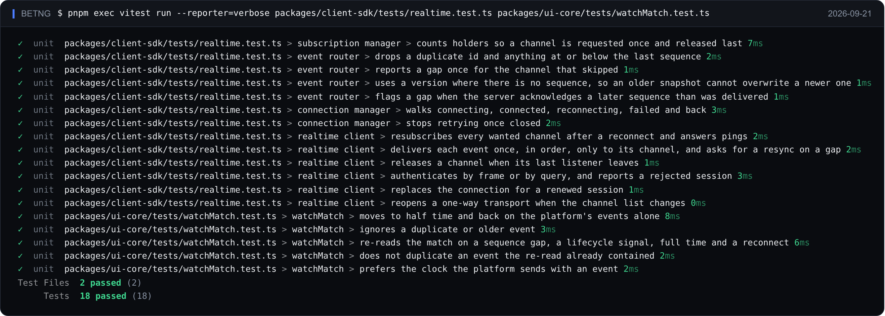

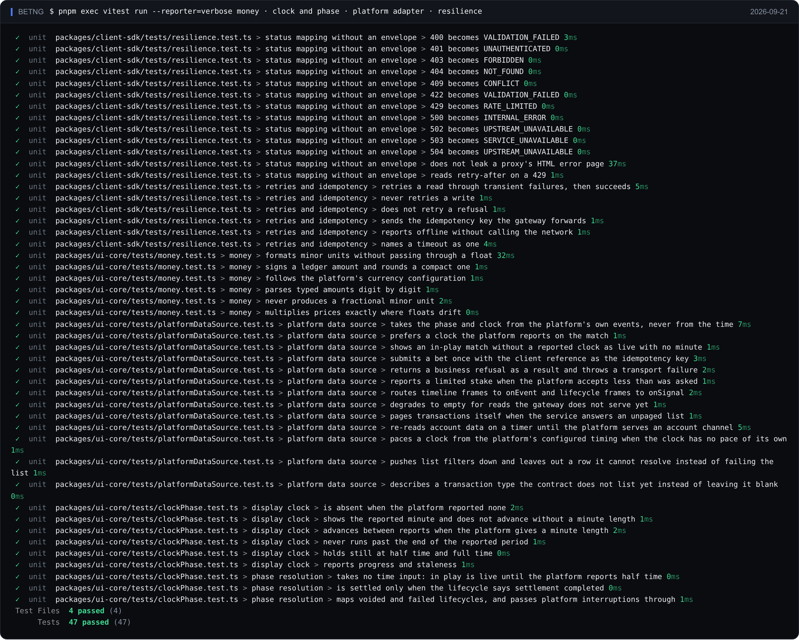

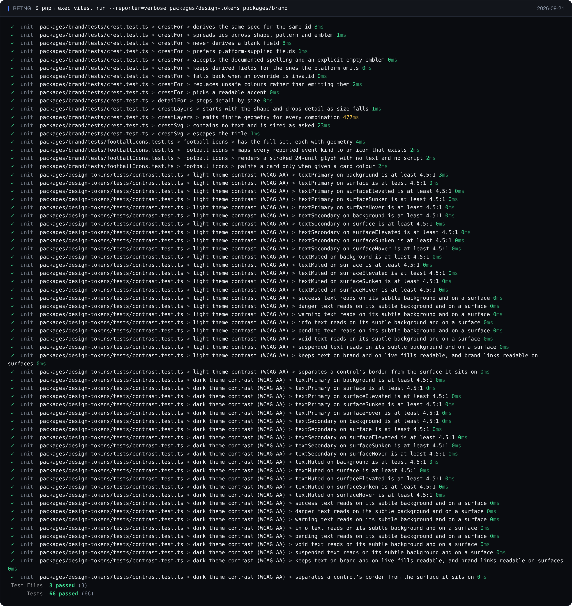

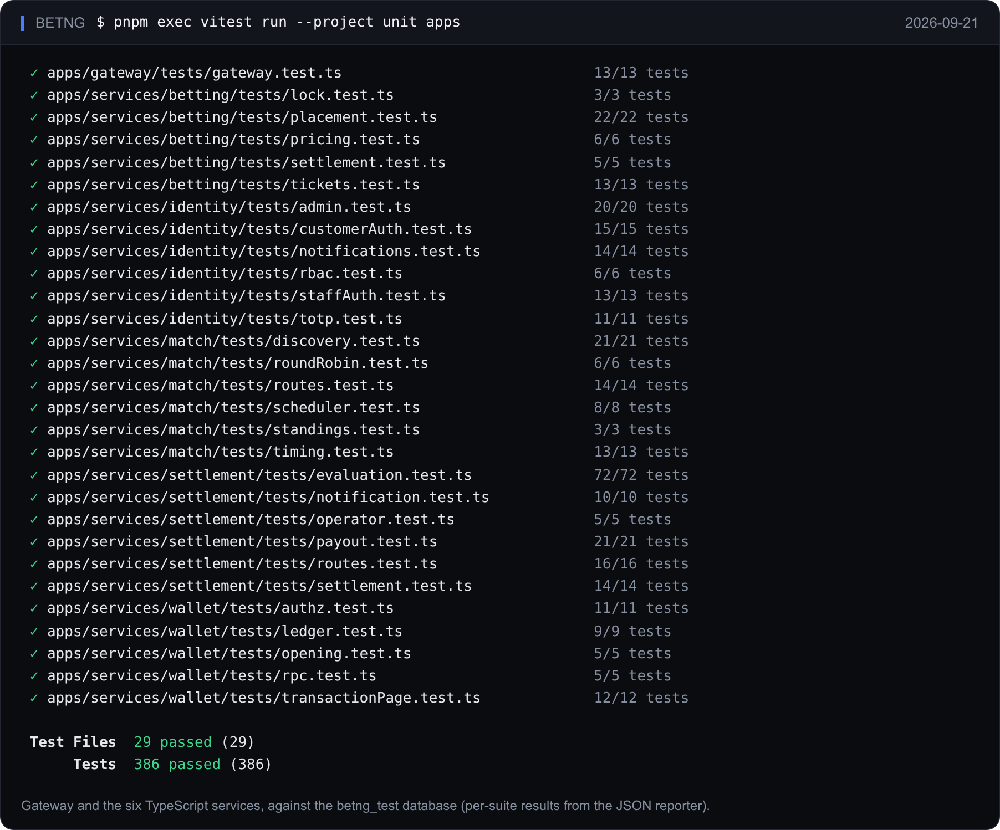

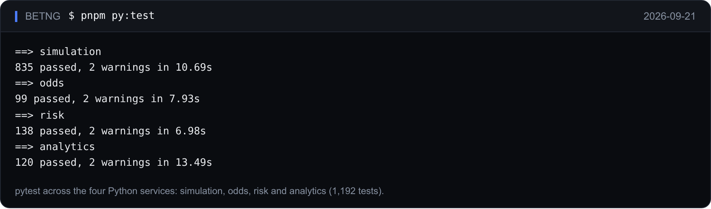

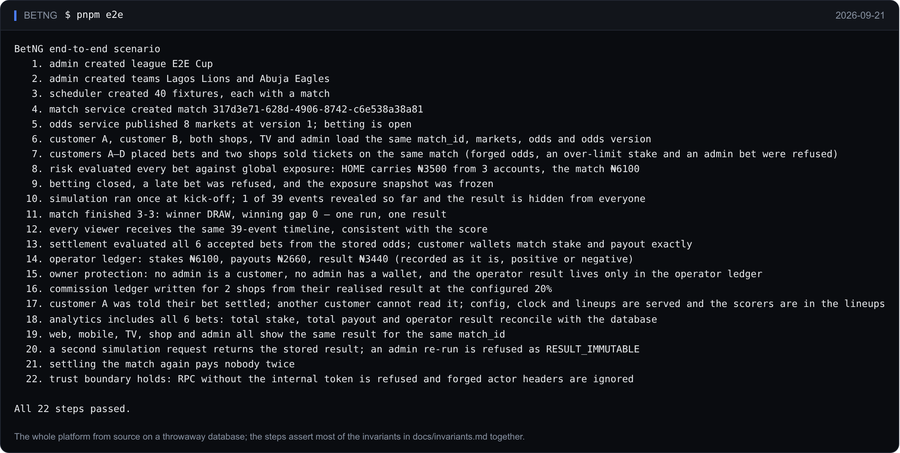
