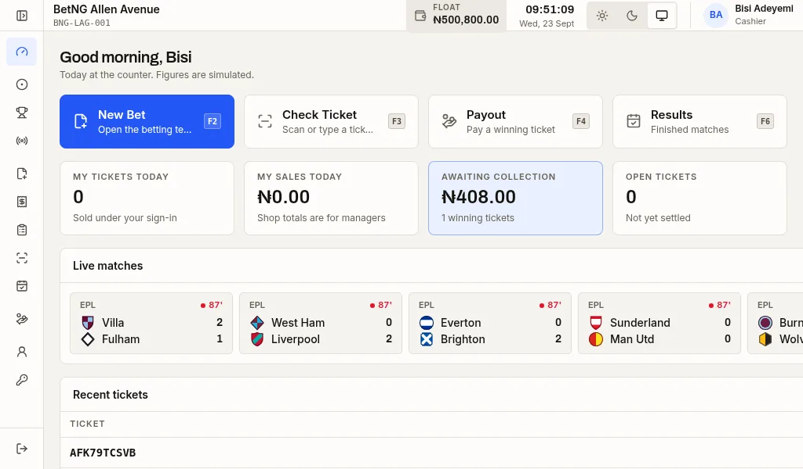
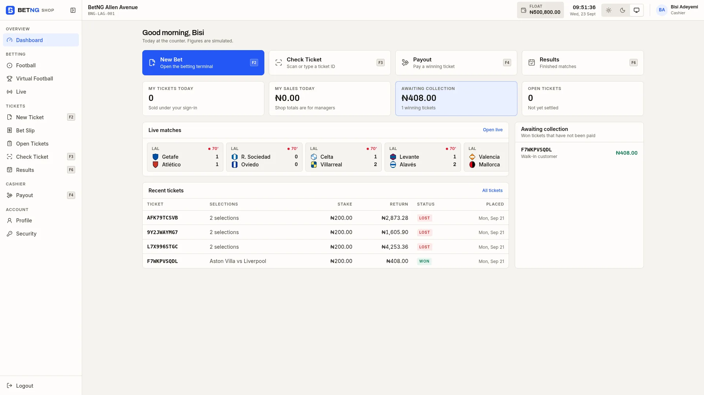
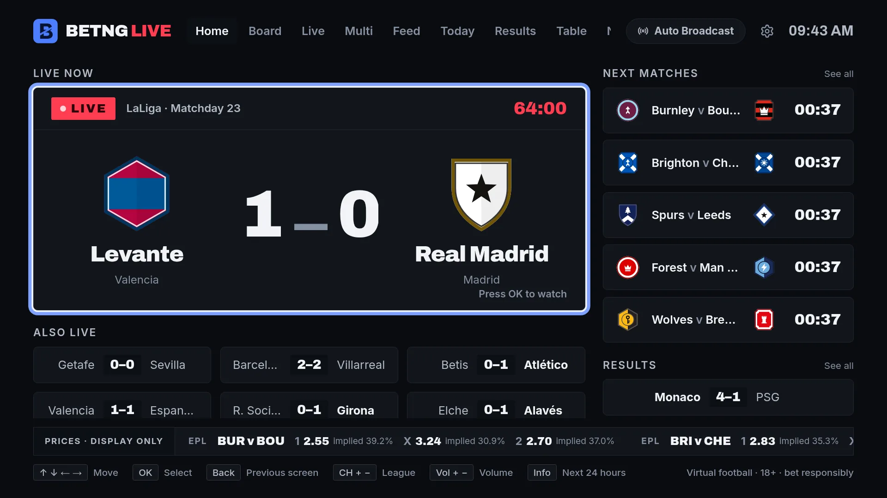
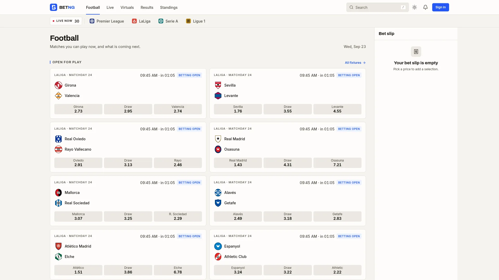
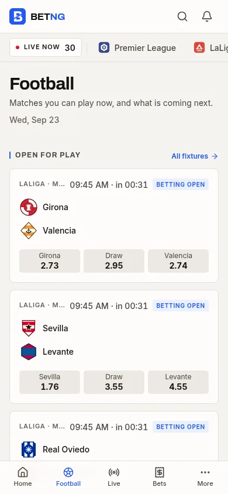
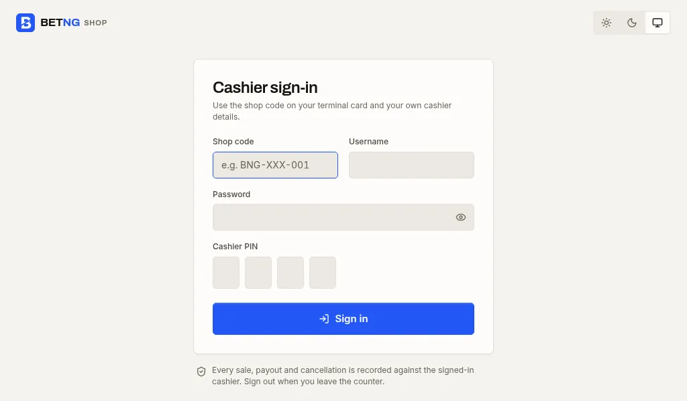

# Viewport QA

The Shop and TV shells promise to hold one screen: the page itself never
scrolls, and anything that must scroll is a named panel inside it. The public
web makes the opposite promise — long content scrolls normally there, and
applying terminal rules to it would be wrong.

Those are measurements, not opinions, so they are measured. This page records
how, what the last run found, and what is still unverified.

## Running it

The stack must be up, because layout against empty states proves nothing: a
page with no matches on it fits any viewport.

```bash
bash scripts/db-bootstrap.sh          # once, creates the service schemas
pnpm dev                              # gateway + services
pnpm --filter @betng/web dev          # :4200
pnpm --filter @betng/tv dev           # :4300
pnpm --filter @betng/shop dev         # :4400

node scripts/qa/viewport-qa.mjs       # writes docs/images/qa/
```

The script asserts nothing. It writes `docs/images/qa/viewport-qa.json` and a
screenshot per viewport, so a regression shows up as a changed number rather
than as a failure nobody looks at.

If the gateway cannot bind port 3000, set `GATEWAY_PORT` to something free in
`.env` and pass `VITE_API_URL=http://127.0.0.1:<port>` to the frontends.
`.env` is gitignored, so that stays local.

## What it measures

| Field | Meaning |
| --- | --- |
| `pageScrollY` / `pageScrollX` | `documentElement.scroll*` minus the viewport. Above 1px the document itself grew. |
| `density` | The `data-density` the Shop shell resolved for that viewport. |
| `rootFontPx` | The computed root font size, which is how TV scales across resolutions. |
| `innerScrollers` | Elements that legitimately scroll inside the shell, with their overflow. |
| `consoleErrors` | Deduplicated console and page errors during load. |

## Last run

Captured 2026-09-23 against the running platform, with real matches, odds and
an authenticated cashier session. Chromium, `deviceScaleFactor: 1`,
`prefers-reduced-motion: reduce`.

### Shop terminal, signed in

The hardest case first. At 1024 × 600 the shell resolves `ULTRA_COMPACT`: the
sidebar collapses to icons, the header loses height, and the float, clock,
cashier identity and function keys all stay on screen. The page does not
scroll — the tickets table below scrolls inside its own panel.



The same workspace at 1920 × 1080 resolves `NORMAL` and spends the extra room
on breathing space rather than stretching the cards.



| Viewport | Density | Page scroll | Bet slip | Errors |
| --- | --- | --- | --- | --- |
| 1024 × 600 | `ULTRA_COMPACT` | 0 | yes | 0 |
| 1280 × 720 | `COMPACT` | 0 | yes | 0 |
| 1366 × 768 | `COMPACT` | 0 | yes | 0 |
| 1920 × 1080 | `NORMAL` | 0 | yes | 0 |
| 2560 × 1440 | `NORMAL` | 0 | yes | 0 |

Density is chosen from the viewport the browser reports, never from a screen
size: two 12-inch terminals can report very different resolutions, and browser
zoom changes the answer again on one machine. See
`apps/shop/src/hooks/useTerminalDensity.ts` and its test.

### TV

TV scales by root font size (`clamp(16px, 1.25vw, 40px)` in
`apps/tv/src/styles/app.css`) rather than by transform, so 4K is genuinely
larger rather than the same layout shrunk into a corner. The remote hints sit
along the bottom and the connection state is never allowed to cover the score.



| Viewport | Root font | Page scroll | Errors |
| --- | --- | --- | --- |
| 1280 × 720 | 16px | 0 | 0 |
| 1920 × 1080 | 24px | 0 | 0 |
| 2560 × 1440 | 32px | 0 | 0 |
| 3840 × 2160 | 40px | 0 | 0 |

### Public web

Not viewport-locked, deliberately. The football page leads with what can be
played now, and scrolls normally past it.



At 390 × 844 the same collections stack, and the bet slip becomes a drawer
rather than taking half the screen.



| Viewport | Page scroll | Errors |
| --- | --- | --- |
| 1920 × 1080 | 5769 | 0 |
| 1366 × 768 | 5789 | 0 |
| 390 × 844 | 12653 | 0 |
| 320 × 568 | 12969 | 5 |

The five at 320 × 568 are `GET /matches/{id}` and `/odds` failures for matches
that finished between the list read and the detail read. Virtual fixtures
rotate every few minutes, so this is the data moving, not a layout fault.

## What this run found

Two real defects, both fixed and re-measured.

**The cashier sign-in page scrolled at 1024 × 600**, by 52px. It sits outside
`TerminalShell` and so never inherited the viewport lock: it used `min-h-dvh`
with a fixed `pb-16`, which at 600px tall pushed the document past the
viewport. It is the first screen on a terminal, so it now uses `h-dvh
overflow-hidden` with the centred area scrolling instead.



**The TV header overflowed its own safe area** at 720p, 1080p and 1440p — by
46px, 68px and 90px. Every item in the header is `whitespace-nowrap`, and the
nav had no `min-w-0`, so it could not shrink and instead pushed the clock and
connection status past the edge, where `overflow: hidden` cut them off. Only
4K had room to fit. The nav now yields space first, so the status group stays
inside the safe area at every size.

Both were invisible to typecheck, lint and the unit suites, and invisible to
reading the CSS. They only appear when something measures a real browser.

## Screenshot index

Every file in `docs/images/qa/`, with the JSON measurements beside them
(`viewport-qa.json`, `shop-auth-qa.json`, `live-qa.json`).

| Surface | Files |
| --- | --- |
| Shop, signed in | `shop-auth-1024x600` · `1280x720` · `1366x768` · `1920x1080` · `2560x1440` |
| Shop sign-in | `shop-1024x600` · `1280x720` · `1366x768` · `1920x1080` · `2560x1440` |
| TV | `tv-1280x720` · `1920x1080` · `2560x1440` · `3840x2160` · `tv-live-1920x1080` |
| Football page | `web-football-1920x1080` · `1366x768` · `390x844` · `320x568` |
| Live and Match Centre | `web-live-1920x1080` · `web-match-centre-1920x1080` · `390x844` · `web-match-centre-live-1920x1080` · `web-match-markets-1920x1080` · `web-match-lineups-1920x1080` |

## Not verified

Stated plainly, because a QA page that implies more coverage than it has is
worse than none.

- **Only the Shop dashboard is captured signed in.** The three-column match and
  market workspace is reached by selecting a match, which this pass does not do.
  Its viewport behaviour is therefore measured on the dashboard route only.
- **No admin app.** `apps/admin` is not in this pass.
- **Chromium only.** No Firefox or WebKit, and no real TV browser or POS
  hardware.
- **No touch, keyboard or screen-reader pass.** The Shop keyboard map is unit
  tested, not driven through a browser here.
- **Light theme only**, at `deviceScaleFactor: 1`. No dark-mode or HiDPI
  capture.
- **Match events written before the per-nationality name pools landed keep
  their stored names.** New squads use the new pools, but an archived replay of
  an older run will still show the old ones.
- **`pnpm test:e2e` has not been run** in this pass; it is a separate CI gate.
